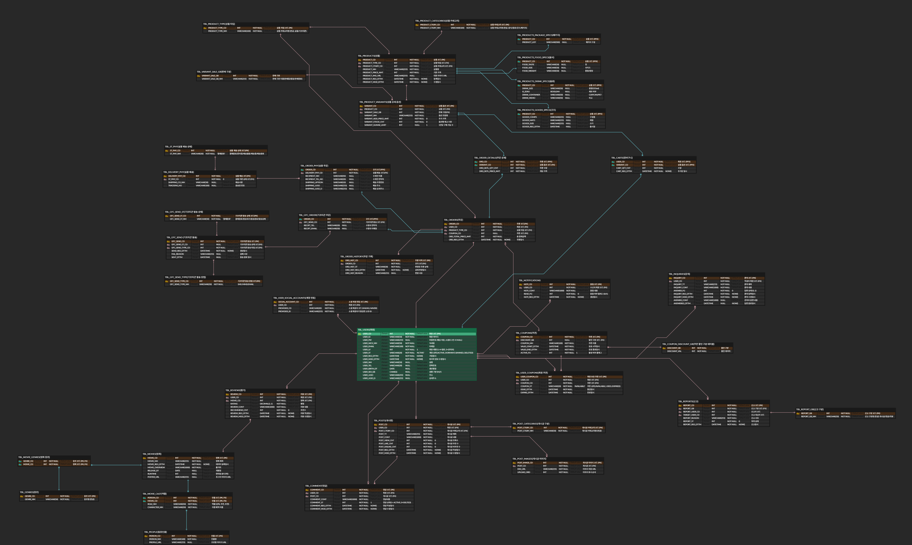

# be22-1st-team4-project

# 🎥 시네파이브 (CINEFIVE)

<div align="center">
  
</div>

---

## 🧑‍💻 팀원 소개 (Team Members)

<!-- 1행 1열 표를 사용하여 팀원들을 가로로 배치하고 중앙 정렬 -->
<table align="center">
  <tr>
    <td align="center">
      <br>
      <b>정진호</b><br>
      팀장 (Leader)
    </td>
    <td align="center">
      <br>
      <b>박찬진</b><br>
      서기 (Secretary)
    </td>
    <td align="center">
      <br>
      <b>최연후</b><br>
      조원 (Member)
    </td>
    <td align="center">
      <br>
      <b>임원석</b><br>
      조원 (Member)
    </td>
    <td align="center">
      <br>
      <b>손창우</b><br>
      조원 (Member)
    </td>
  </tr>
</table>

---

## 💡 1. 프로젝트 개요

**시네파이브**(CINEFIVE)는 사용자의 취향을 분석하여 영화를 추천하고, 예매 연계 및 관련 상품 구매까지 한 번에 해결할 수 있는 **영화 중심 통합 플랫폼**입니다. 기존의 분산된 영화 관련 활동의 불편함을 해소하고, 사용자 편의성과 몰입도를 높이는 것을 목표로 합니다.

### 🎯 1-1. 프로젝트 주제

영화 추천, 예매 연계, 굿즈 주문, 커뮤니티 기능을 결합한 **통합 영화 커뮤니티 플랫폼 개발**

### 📌 1-2. 프로젝트 배경 및 필요성

영화 정보, 예매, 후기 공유, 굿즈 구매 등의 기능이 서로 다른 플랫폼에 **분산되어 있는 불편함**을 해소하고, 영화와 관련된 모든 활동을 하나의 서비스에서 통합적으로 제공하여 사용자 편의성과 몰입도를 높이기 위해 씨네파이브가 기획되었습니다.

---

## 🛠️ 2. 기술 스택

| 영역 (Category) | 기술 (Technology) | 설명 (Description) |
| :--- | :--- | :--- |
| **Database** | `MariaDB` | 영화 정보, 사용자 데이터, 게시물 등 핵심 데이터 관리 |
| **Server OS** | `Linux` | 서버 운영 및 배포 환경 구축 |
| **DB Tool** | `DataGrip` | 데이터베이스 모델링, 개발 및 관리 도구 |


---

## ✨ 3. 씨네파이브 주요 기능

### 🎯 3-1. 추천 시스템
- 사용자 선호도, 시청 이력, 평가 데이터를 기반으로 한 **AI 개인화 영화 추천**

### 🎟️ 3-2. 예매 기능
- 여러 극장과 연동된 **영화 예매 통합 관리**

### 🛒 3-3. 주문 기능
- 영화 관련 **굿즈·티켓·콜라보 상품** 구매 기능
- 포인트 및 쿠폰을 통한 간편 결제 시스템

### 💬 3-4. 게시판 / 커뮤니티
- 영화 후기, 정보 공유, 자유 게시판 운영
- 좋아요, 댓글, 레벨로 활발한 참여 유도

---

## 🌟 4. 차별화 전략

| 항목 | 기존 서비스 | 씨네파이브 차별점 |
| :--- | :--- | :--- |
| **영화 추천** | 단순 인기순/장르 기반 | **AI 기반 개인 맞춤 추천** |
| **예매 연계** | 단일 극장 중심 | **통합 예매 연계 시스템** |
| **커뮤니티** | 제한된 후기 작성 | **자유로운 주제의 게시판, 실시간 소통** |
| **굿즈 판매** | 별도 사이트 이동 필요 | **내부 연동된 굿즈 스토어** |
| **데이터 활용** | 제한적 | **사용자 행동 기반 피드백 시스템** |

---

## 📈 5. 기대 효과

- **원스톱 영화 서비스 구현:** 영화 추천, 예매, 굿즈, 커뮤니티 활동을 한 플랫폼에서 통합 제공하여 편의성 및 몰입도 증대.
- **개인 맞춤형 경험 제공:** 사용자 선호 기반 알고리즘을 통해 이용자에게 맞는 영화를 빠르게 발견 가능.
- **커뮤니티 중심의 영화 생태계 형성:** 활발한 소통을 통해 영화 소비 문화 활성화.
- **국내 영화 산업 발전 기여:** 독립 영화 등 노출 기회 확대 및 시장 활성화.

---

## 🏗️ 6. 프로젝트 구조

📂 be22-1st-team4-project/   
├── 📂 img/ (로고 및 팀원 이미지)   
├── 📂 test/ (테스트 관련 파일)   
├── 📄 .gitignore (버전 관리 제외 목록)   
├── 📄 README.md (현재 문서)   
└── 📄 createtable.sql (데이터베이스 테이블 생성 스크립트)   

---

## 📄 7. 요구사항 명세서

[📑 요구사항 명세서 확인하기](https://docs.google.com/spreadsheets/d/1Dzsq76gKhSPuUmJWd8vvfGTF1MSGJRGIXNhX9SVIqMY/edit?gid=1378379683#gid=1378379683)

---

## 🗺️ 8. 유스케이스

<div align="center">

</div>

유스케이스 다이어그램은 아래 링크에서 확인할 수 있습니다:  
[📂 유스케이스 다이어그램 확인하기](https://drive.google.com/file/d/1kIo6SOqdB-oSVYlT01-yCAPYiYR3gZuV/view?usp=drive_link)

---

## 🗃️ 9. ERD 모델링 (ERD Modeling)
<div align="center">

</div>

---

## 📋 10. 테이블 구조 (Table Structure)
프로젝트에서 사용되는 전체 테이블의 상세 구조입니다.
### 10-1. 회원 및 권한
#### TBL_USERS
| 컬럼명 | 데이터 타입 | 제약 조건 | 설명 |
|---|---|---|---|
| USER_CD | INT | PK, NOT NULL, AUTO_INCREMENT | 회원 코드 (PK) |
| USER_ID | VARCHAR(50) | NOT NULL | 회원 아이디 |
| USER_PW | VARCHAR(255) | NULL | 비밀번호 (해싱 저장, 소셜로그인 시 NULL) |
| USER_NICK_NM | VARCHAR(50) | NOT NULL | 닉네임 |
| USER_EMAIL | VARCHAR(100) | NOT NULL | 이메일 |
| USER_LV | INT | NOT NULL, DEFAULT 1 | 회원 레벨 (1-4=일반, 5=관리자) |
| USER_ST | VARCHAR(20) | NOT NULL, DEFAULT 'ACTIVE' | 계정 상태 (ACTIVE, DORMANT, BANNED, DELETED) |
| USER_REG_DTTM | DATETIME | NOT NULL, DEFAULT NOW() | 가입일시 |
| USER_MOD_DTTM | DATETIME | NOT NULL, DEFAULT NOW() | 마지막 정보 수정일시 |
| USER_NM | VARCHAR(50) | NULL | 실명 |
| USER_TEL | VARCHAR(20) | NULL | 전화번호 |
| USER_BIRTH_DT | DATE | NULL | 생년월일 |
| USER_SEX_GB | CHAR(1) | NULL | 성별 구분 (M,F) |
| USER_JUSO | VARCHAR(255) | NULL | 주소 |
| USER_JUSO_D | VARCHAR(255) | NULL | 상세주소 |

#### TBL_USER_SOCIAL_ACCOUNTS
| 컬럼명 | 데이터 타입 | 제약 조건 | 설명 |
|---|---|---|---|
| SOCIAL_ACCOUNT_CD | INT | PK, NOT NULL, AUTO_INCREMENT | 소셜 계정 연동 코드 (PK) |
| USER_CD | INT | FK, NOT NULL | 회원 코드 (FK) |
| PROVIDER_CD | VARCHAR(20) | NOT NULL | 소셜 제공자 코드 (KAKAO, NAVER) |
| PROVIDER_ID | VARCHAR(255) | NOT NULL | 소셜 제공자가 발급한 고유 ID |

### 10-2. 상품
#### TBL_PRODUCT_CATEGORIES
| 컬럼명 | 데이터 타입 | 제약 조건 | 설명 |
|---|---|---|---|
| PRODUCT_CTGRY_CD | INT | PK, NOT NULL, AUTO_INCREMENT | 상품 카테고리 코드 (PK) |
| PRODUCT_CTGRY_NM | VARCHAR(100) | NOT NULL | 상품 카테고리명 (한글, 음식/음료/굿즈/패키지) |

#### TBL_PRODUCT_TYPE
| 컬럼명 | 데이터 타입 | 제약 조건 | 설명 |
|---|---|---|---|
| PRODUCT_TYPE_CD | INT | PK, NOT NULL, AUTO_INCREMENT | 상품 타입 코드 (PK) |
| PRODUCT_TYPE_NM | VARCHAR(100) | NOT NULL | 상품 타입명 (한글, 실물/기프티콘) |

#### TBL_PRODUCTS
| 컬럼명 | 데이터 타입 | 제약 조건 | 설명 |
|---|---|---|---|
| PRODUCT_CD | INT | PK, NOT NULL, AUTO_INCREMENT | 상품 코드 (PK) |
| PRODUCT_TYPE_CD | INT | FK, NOT NULL | 상품 타입 코드 (FK) |
| PRODUCT_CTGRY_CD | INT | FK, NOT NULL | 상품 카테고리 코드 (FK) |
| PRODUCT_NM | VARCHAR(255) | NOT NULL | 상품명 |
| PRODUCT_PRICE_AMT | INT | NOT NULL | 기본 가격 |
| PRODUCT_IMG_URL | VARCHAR(255) | NULL | 대표 이미지 URL |
| PRODUCT_REG_DTTM | DATETIME | NOT NULL, DEFAULT NOW() | 등록일시 |
| PRODUCT_MOD_DTTM | DATETIME | NOT NULL, DEFAULT NOW() | 수정일시 |

#### TBL_PRODUCTS_PACKAGE_SPECS
| 컬럼명 | 데이터 타입 | 제약 조건 | 설명 |
|---|---|---|---|
| PRODUCT_CD | INT | PFK, NOT NULL | 상품 코드 (PFK) |
| PRODUCT_LIST | VARCHAR(500) | NULL | 패키지 구성 |

#### TBL_PRODUCTS_DRINK_SPECS
| 컬럼명 | 데이터 타입 | 제약 조건 | 설명 |
|---|---|---|---|
| PRODUCT_CD | INT | PFK, NOT NULL | 상품 코드 (PFK) |
| DRINK_SIZE | VARCHAR(50) | NULL | 용량(355ml) |
| IS_ZERO | BOOLEAN | NULL | 제로 여부 |
| DRINK_CONTAINER | VARCHAR(50) | NULL | CUP/CAN/PET |
| DRINK_MEMO | VARCHAR(50) | NULL | 비고 |

#### TBL_PRODUCTS_FOOD_SPECS
| 컬럼명 | 데이터 타입 | 제약 조건 | 설명 |
|---|---|---|---|
| PRODUCT_CD | INT | PFK, NOT NULL | 상품 코드 (PFK) |
| FOOD_TASTE | VARCHAR(50) | NULL | 맛 |
| FOOD_SIZE | VARCHAR(50) | NULL | 사이즈 |
| FOOD_WEIGHT | VARCHAR(50) | NULL | 중량/용량 |

#### TBL_PRODUCTS_GOODS_SPECS
| 컬럼명 | 데이터 타입 | 제약 조건 | 설명 |
|---|---|---|---|
| PRODUCT_CD | INT | PFK, NOT NULL | 상품 코드 (PFK) |
| GOODS_COMPS | VARCHAR(255) | NULL | 구성품 |
| GOODS_MATS | VARCHAR(255) | NULL | 재질 |
| GOODS_SIZE | VARCHAR(255) | NULL | 크기 |
| GOODS_REG_DTTM | DATETIME | NULL | 출시일 |

#### TBL_VARIANT_SALE_GB
| 컬럼명 | 데이터 타입 | 제약 조건 | 설명 |
|---|---|---|---|
| VARIANT_SALE_GB | INT | PK, NOT NULL, AUTO_INCREMENT | 판매 구분 |
| VARIANT_SALE_GB_NM | VARCHAR(255) | NOT NULL | 판매 구분 이름(판매중/품절/판매종료) |

#### TBL_PRODUCT_VARIANTS
| 컬럼명 | 데이터 타입 | 제약 조건 | 설명 |
|---|---|---|---|
| VARIANT_CD | INT | PK, NOT NULL, AUTO_INCREMENT | 상품 옵션 코드 (PK) |
| PRODUCT_CD | INT | FK, NOT NULL | 상품 코드 (FK) |
| VARIANT_SALE_GB | INT | FK, NOT NULL | 판매 구분(FK) |
| VARIANT_NM | VARCHAR(255) | NOT NULL | 옵션 조합명 |
| VARIANT_ADD_PRICE_AMT | INT | NOT NULL, DEFAULT 0 | 추가 가격 |
| VARIANT_STOCK_CNT | INT | NOT NULL, DEFAULT 0 | 옵션별 재고 수량 |
| VARIANT_GUMAE_LIMIT | INT | NULL, DEFAULT 1 | 1인당 구매 가능 수 |

### 10-3. 주문 및 결제
#### TBL_ORDERS
| 컬럼명 | 데이터 타입 | 제약 조건 | 설명 |
|---|---|---|---|
| ORDER_CD | INT | PK, NOT NULL, AUTO_INCREMENT | 주문 코드(PK) |
| USER_CD | INT | FK, NOT NULL | 회원 코드 (FK) |
| PRODUCT_TYPE_CD | INT | FK, NOT NULL | 상품 타입 코드 (FK) |
| COUPON_CD | INT | FK, NULL | 적용된 쿠폰 코드 (FK) |
| ORDER_TOTAL_PRICE_AMT | INT | NOT NULL | 총 결제금액 |
| ORDER_REG_DTTM | DATETIME | NOT NULL, DEFAULT NOW() | 주문일시 |

#### TBL_ORDER_DETAILS
| 컬럼명 | 데이터 타입 | 제약 조건 | 설명 |
|---|---|---|---|
| ORDER_CD | INT | PFK, NOT NULL | 주문 코드 (PFK) |
| VARIANT_CD | INT | FK, NOT NULL | 상품 옵션 코드 (FK) |
| ORD_DETL_QTY_CNT | INT | NOT NULL | 주문 수량 |
| ORD_DETL_PRICE_AMT | INT | NOT NULL | 개당 가격 |

#### TBL_ORDER_HISTORY
| 컬럼명 | 데이터 타입 | 제약 조건 | 설명 |
|---|---|---|---|
| ORD_HIST_CD | INT | PK, NOT NULL, AUTO_INCREMENT | 주문 이력 코드 (PK) |
| ORDER_CD | INT | FK, NOT NULL | 주문 코드(FK) |
| ORD_HIST_ST | VARCHAR(30) | NOT NULL | 변경된 주문 상태 |
| ORD_HIST_REG_DTTM | DATETIME | NOT NULL, DEFAULT NOW() | 상태 변경일시 |
| ORD_HIST_REASON | VARCHAR(255) | NULL | 변경 사유 |

#### TBL_ST_PHY
| 컬럼명 | 데이터 타입 | 제약 조건 | 설명 |
|---|---|---|---|
| ST_PHY_CD | INT | PK, NOT NULL, AUTO_INCREMENT | 실물 배송 상태 코드(PK) |
| ST_PHY_NM | VARCHAR(50) | NOT NULL, DEFAULT '결제완료' | 결제완료/준비중/배송출발/배송중/배송완료 |

#### TBL_DELIVERY_PHY
| 컬럼명 | 데이터 타입 | 제약 조건 | 설명 |
|---|---|---|---|
| DELIVERY_PHY_CD | INT | PK, NOT NULL, AUTO_INCREMENT | 실물 배송 코드(PK) |
| ST_PHY_CD | INT | FK, NOT NULL, DEFAULT 1 | 실물 주문 상태 코드(FK) |
| SHIPPING_CO_NM | VARCHAR(50) | NULL | 배송사명 |
| TRACKING_NO | VARCHAR(100) | NULL | 운송장 번호 |

#### TBL_ORDER_PHY
| 컬럼명 | 데이터 타입 | 제약 조건 | 설명 |
|---|---|---|---|
| ORDER_CD | INT | PFK, NOT NULL | 주문 코드(PFK) |
| DELIVERY_PHY_CD | INT | FK, NOT NULL | 실물 배송 코드(FK) |
| RECIPIENT_NM | VARCHAR(50) | NULL | 수취인 이름 |
| RECIPIENT_TEL_NO | VARCHAR(20) | NULL | 수취인 연락처 |
| SHIPPING_UPYEON | VARCHAR(10) | NULL | 배송 우편번호 |
| SHIPPING_JUSO | VARCHAR(255) | NULL | 배송 주소 |
| SHIPPING_JUSO_D | VARCHAR(255) | NULL | 배송 상세주소 |

#### TBL_GFC_SEND_ST
| 컬럼명 | 데이터 타입 | 제약 조건 | 설명 |
|---|---|---|---|
| GFC_SEND_ST_CD | INT | PK, NOT NULL, AUTO_INCREMENT | 기프티콘 발송 상태 코드(PK) |
| GFC_SEND_ST_NM | VARCHAR(50) | NOT NULL, DEFAULT '결제완료' | 결제완료/발송대기/발송완료/발송실패 |

#### TBL_GFC_SEND_TYPE
| 컬럼명 | 데이터 타입 | 제약 조건 | 설명 |
|---|---|---|---|
| GFC_SEND_TYPE_CD | INT | PK, NOT NULL, AUTO_INCREMENT | 기프티콘 발송 방법 코드(PK) |
| GFC_SEND_TYPE_NM | VARCHAR(50) | NOT NULL | SMS/MMS/EMAIL |

#### TBL_GFC_SEND
| 컬럼명 | 데이터 타입 | 제약 조건 | 설명 |
|---|---|---|---|
| GFC_SEND_CD | INT | PK, NOT NULL, AUTO_INCREMENT | 기프티콘 발송 코드 (PK) |
| GFC_SEND_ST_CD | INT | FK, NULL | 기프티콘 발송 상태 코드(FK) |
| GFC_SEND_TYPE_CD | INT | FK, NOT NULL | 기프티콘 발송 타입 코드(FK) |
| SEND_REG_DTTM | DATETIME | NOT NULL, DEFAULT NOW() | 생성일시 |
| FAIL_REASON | VARCHAR(255) | NULL | 실패 사유 |
| SENT_DTTM | DATETIME | NULL | 발송 완료 일시 |

#### TBL_GFC_ORDER
| 컬럼명 | 데이터 타입 | 제약 조건 | 설명 |
|---|---|---|---|
| ORDER_CD | INT | PFK, NOT NULL | 주문 코드(PFK) |
| GFC_SEND_CD | INT | FK, NOT NULL | 기프티콘 발송 코드 (FK) |
| RECIPT_TEL | VARCHAR(20) | NULL | 수령자 연락처 |
| RECIPT_EMAIL | VARCHAR(50) | NULL | 수령자 이메일 |

#### TBL_CARTS
| 컬럼명 | 데이터 타입 | 제약 조건 | 설명 |
|---|---|---|---|
| USER_CD | INT | PFK, NOT NULL | 회원 코드 (PFK) |
| VARIANT_CD | INT | PFK, NOT NULL | 상품 옵션 코드 (PFK) |
| CART_QTY_CNT | INT | NOT NULL | 수량 |
| CART_REG_DTTM | DATETIME | NOT NULL, DEFAULT NOW() | 추가된 일시 |

### 10-4. 커뮤니티
#### TBL_POST_CATEGORIES
| 컬럼명 | 데이터 타입 | 제약 조건 | 설명 |
|---|---|---|---|
| POST_CTGRY_CD | INT | PK, NOT NULL, AUTO_INCREMENT | 게시글 카테고리 코드 (PK) |
| POST_CTGRY_NM | VARCHAR(50) | NOT NULL | 게시글 카테고리명 (한글) |

#### TBL_POSTS
| 컬럼명 | 데이터 타입 | 제약 조건 | 설명 |
|---|---|---|---|
| POST_CD | INT | PK, NOT NULL, AUTO_INCREMENT | 게시글 코드 (PK) |
| USER_CD | INT | FK, NULL | 회원 코드 (FK), 탈퇴 시 NULL |
| POST_CTGRY_CD | INT | FK, NOT NULL | 게시글 카테고리 코드 (FK) |
| POST_TT | VARCHAR(255) | NOT NULL | 게시글 제목 |
| POST_CONT | VARCHAR(1000) | NOT NULL | 게시글 내용 |
| POST_VIEW_CNT | INT | NOT NULL, DEFAULT 0 | 게시글 조회수 |
| POST_LIKE_CNT | INT | NOT NULL, DEFAULT 0 | 게시글 추천 수 |
| POST_DISLIKE_CNT | INT | NOT NULL, DEFAULT 0 | 게시글 비추천 수 |
| POST_REG_DTTM | DATETIME | NOT NULL, DEFAULT NOW() | 게시글 작성일시 |
| POST_MOD_DTTM | DATETIME | NOT NULL, DEFAULT NOW() | 게시글 수정일시 |

#### TBL_COMMENT
| 컬럼명 | 데이터 타입 | 제약 조건 | 설명 |
|---|---|---|---|
| COMMENT_CD | INT | PK, NOT NULL, AUTO_INCREMENT | 댓글 코드 (PK) |
| USER_CD | INT | FK, NULL | 회원 코드 (FK), 탈퇴 시 NULL |
| POST_CD | INT | FK, NOT NULL | 게시글 코드 (FK) |
| COMMENT_CONT | VARCHAR(1000) | NOT NULL | 댓글내용 |
| COMMENT_ST | INT | NOT NULL, DEFAULT 1 | 댓글 상태(1= ACTIVE, 0=DELTED) |
| COMMENT_REG_DTTM | DATETIME | NOT NULL, DEFAULT NOW() | 댓글 작성일시 |
| COMMENT_MOD_DTTM | DATETIME | NOT NULL, DEFAULT NOW() | 댓글 수정일시 |

#### TBL_POST_IMAGES
| 컬럼명 | 데이터 타입 | 제약 조건 | 설명 |
|---|---|---|---|
| POST_IMAGE_CD | INT | PK, NOT NULL, AUTO_INCREMENT | 게시글 이미지 코드 (PK) |
| POST_CD | INT | FK, NOT NULL | 게시글 코드 (FK) |
| IMG_URL | VARCHAR(255) | NOT NULL | 이미지 저장 URL |
| UPLOAD_ORD | INT | NOT NULL | 이미지 표시 순서 |

### 10-5. 프로모션 및 CS
#### TBL_COUPON_DISCOUNT_GB
| 컬럼명 | 데이터 타입 | 제약 조건 | 설명 |
|---|---|---|---|
| DISCOUNT_GB | INT | PK, NOT NULL, AUTO_INCREMENT | 할인 구분 |
| DISCOUNT_VAL | INT | NOT NULL | 할인 데이터 |

#### TBL_COUPONS
| 컬럼명 | 데이터 타입 | 제약 조건 | 설명 |
|---|---|---|---|
| COUPON_CD | INT | PK, NOT NULL, AUTO_INCREMENT | 쿠폰 코드 (PK) |
| DISCOUNT_GB | INT | FK, NULL | 할인 구분 코드 (FK) |
| COUPON_NM | VARCHAR(100) | NOT NULL | 쿠폰 이름 |
| VALID_START_DTTM | DATETIME | NOT NULL | 유효 시작일시 |
| VALID_END_DTTM | DATETIME | NOT NULL | 유효 종료일시 |
| ACTIVE_FG | INT | NOT NULL, DEFAULT 1 | 활성 여부 플래그 |

#### TBL_USER_COUPONS
| 컬럼명 | 데이터 타입 | 제약 조건 | 설명 |
|---|---|---|---|
| USER_COUPON_CD | INT | PK, NOT NULL, AUTO_INCREMENT | 회원 보유 쿠폰 코드 (PK) |
| USER_CD | INT | FK, NOT NULL | 회원 코드 (FK) |
| COUPON_CD | INT | FK, NOT NULL | 쿠폰 코드 (FK) |
| COUPON_ST | VARCHAR(20) | NOT NULL, DEFAULT 'AVAILABLE' | 쿠폰 상태 (AVAILABLE, USED, EXPIRED) |
| ISSUE_DTTM | DATETIME | NOT NULL | 발급일시 |
| EXPIRE_DTTM | DATETIME | NOT NULL | 만료일시 |

#### TBL_NOTIFICATIONS
| 컬럼명 | 데이터 타입 | 제약 조건 | 설명 |
|---|---|---|---|
| NOTI_CD | INT | PK, NOT NULL, AUTO_INCREMENT | 알림 코드 (PK) |
| USER_CD | INT | FK, NOT NULL | 수신자 회원 코드 (FK) |
| NOTI_CONT | VARCHAR(1000) | NOT NULL | 알림 내용 |
| READ_FG | INT | NOT NULL, DEFAULT 0 | 읽음 여부 플래그 (0/1) |
| NOTI_REG_DTTM | DATETIME | NOT NULL, DEFAULT NOW() | 생성일시 |

#### TBL_INQUIRIES
| 컬럼명 | 데이터 타입 | 제약 조건 | 설명 |
|---|---|---|---|
| INQUIRY_CD | INT | PK, NOT NULL, AUTO_INCREMENT | 문의 코드 (PK) |
| USER_CD | INT | FK, NULL | 작성자 회원 코드 (FK), 탈퇴 시 NULL |
| INQUIRY_TT | VARCHAR(255) | NOT NULL | 문의 제목 |
| INQUIRY_CONT | VARCHAR(1000) | NOT NULL | 문의 내용 |
| ANSWER_FG | INT | NOT NULL, DEFAULT 0 | 답변 상태 (0, 1) |
| INQUIRY_REG_DTTM | DATETIME | NOT NULL, DEFAULT NOW() | 문의 등록일시 |
| INQUIRY_MOD_DTTM | DATETIME | NOT NULL, DEFAULT NOW() | 문의 수정일시 |
| ANSWER_CONT | VARCHAR(1000) | NULL | 관리자 답변 내용 |
| ANSWERED_DTTM | DATETIME | NULL | 답변 완료일시 |

#### TBL_REPORT_GB
| 컬럼명 | 데이터 타입 | 제약 조건 | 설명 |
|---|---|---|---|
| REPORT_GB | INT | PK, NOT NULL, AUTO_INCREMENT | 신고 구분 코드 (PK) |
| REPORT_GB_NM | VARCHAR(50) | NOT NULL | 신고 구분명 (한글) 게시글/댓글/리뷰 |

#### TBL_REPORTS
| 컬럼명 | 데이터 타입 | 제약 조건 | 설명 |
|---|---|---|---|
| REPORT_CD | INT | PK, NOT NULL, AUTO_INCREMENT | 신고 코드 (PK) |
| REPORT_GB | INT | FK, NOT NULL | 신고 구분 코드 (FK) |
| REPORT_USER_CD | INT | FK, NULL | 신고자 코드, 탈퇴 시 NULL |
| TARGET_USER_CD | INT | FK, NULL | 신고 대상자 코드, 탈퇴 시 NULL |
| REPORT_REASON | VARCHAR(255) | NOT NULL | 신고 사유 |
| REPORT_ST | INT | NOT NULL, DEFAULT 0 | 처리 상태 |
| REPORT_REG_DTTM | DATETIME | NOT NULL, DEFAULT NOW() | 신고일시 |

### 10-6. 영화 정보
#### TBL_MOVIES
| 컬럼명 | 데이터 타입 | 제약 조건 | 설명 |
|---|---|---|---|
| MOVIE_CD | INT | PK, NOT NULL, AUTO_INCREMENT | 영화 코드 (PK) |
| MOVIE_NM | VARCHAR(255) | NOT NULL | 영화 제목 |
| MOVIE_REG_DTTM | DATETIME | NOT NULL, DEFAULT NOW() | 데이터 등록일시 |
| MOVIE_OVERVIEW | VARCHAR(1000) | NOT NULL | 줄거리 |
| RELEASE_DT | DATE | NULL | 개봉일 |
| RUNTIME | INT | NULL | 런타임 (분 단위) |
| POSTER_URL | VARCHAR(255) | NULL | 포스터 이미지 URL |

#### TBL_GENRES
| 컬럼명 | 데이터 타입 | 제약 조건 | 설명 |
|---|---|---|---|
| GENRE_CD | INT | PK, NOT NULL, AUTO_INCREMENT | 장르 코드 (PK) |
| GENRE_NM | VARCHAR(50) | NOT NULL | 장르명 (한글) |

#### TBL_MOVIE_GENRES
| 컬럼명 | 데이터 타입 | 제약 조건 | 설명 |
|---|---|---|---|
| GENRE_CD | INT | PFK, NOT NULL | 장르 코드 (PK, FK) |
| MOVIE_CD | INT | PFK, NOT NULL | 영화 코드 (PK, FK) |

#### TBL_PEOPLE
| 컬럼명 | 데이터 타입 | 제약 조건 | 설명 |
|---|---|---|---|
| PERSON_CD | INT | PK, NOT NULL, AUTO_INCREMENT | 인물 코드 (PK) |
| PERSON_NM | VARCHAR(100) | NOT NULL | 인물명 |
| PROFILE_URL | VARCHAR(255) | NULL | 프로필 이미지 URL |

#### TBL_MOVIE_CAST
| 컬럼명 | 데이터 타입 | 제약 조건 | 설명 |
|---|---|---|---|
| PERSON_CD | INT | PFK, NOT NULL | 인물 코드 (PK, FK) |
| MOVIE_CD | INT | PFK, NOT NULL | 영화 코드 (PK, FK) |
| ROLE_NM | VARCHAR(50) | NOT NULL | 역할 (감독, 주연, 조연) |
| CHARACTER_NM | VARCHAR(50) | NOT NULL | 극중 배역 이름 |

<details><summary><b> 테이블정의서(DDL) </b></summary>
<br>
  
```sql
-- =======================================================================
-- 제약 조건 설정을 위해 잠시 FK 체크를 비활성화합니다.
-- =======================================================================
SET foreign_key_checks = 0;

-- =======================================================================
-- TBL_USERS : 회원
-- USER_ST 컬럼을 통해 논리적 삭제(Soft Delete)를 구현합니다.
-- =======================================================================
DROP TABLE IF EXISTS `TBL_USERS`;
CREATE TABLE `TBL_USERS` (
	`USER_CD`	INT	NOT NULL AUTO_INCREMENT	COMMENT '회원 코드 (PK)',
	`USER_ID`	VARCHAR(50)	NOT NULL	COMMENT '회원 아이디',
	`USER_PW`	VARCHAR(255)	NULL	COMMENT '비밀번호 (해싱 저장, 소셜로그인 시 NULL)',
	`USER_NICK_NM`	VARCHAR(50)	NOT NULL	COMMENT '닉네임',
	`USER_EMAIL`	VARCHAR(100)	NOT NULL	COMMENT '이메일',
	`USER_LV`	INT	NOT NULL	DEFAULT 1	COMMENT '회원 레벨 (1-4=일반, 5=관리자)',
	`USER_ST`	VARCHAR(20)	NOT NULL	DEFAULT 'ACTIVE'	COMMENT '계정 상태 (ACTIVE, DORMANT, BANNED, DELETED)',
	`USER_REG_DTTM`	DATETIME	NOT NULL	DEFAULT NOW()	COMMENT '가입일시',
	`USER_MOD_DTTM`	DATETIME	NOT NULL	DEFAULT NOW()	COMMENT '마지막 정보 수정일시',
	`USER_NM`	VARCHAR(50)	NULL	COMMENT '실명',
	`USER_TEL`	VARCHAR(20)	NULL	COMMENT '전화번호',
	`USER_BIRTH_DT`	DATE	NULL	COMMENT '생년월일',
	`USER_SEX_GB`	CHAR(1)	NULL	COMMENT '성별 구분 (M,F)',
	`USER_JUSO`	VARCHAR(255)	NULL	COMMENT '주소',
	`USER_JUSO_D`	VARCHAR(255)	NULL	COMMENT '상세주소',
	CONSTRAINT `PK_TBL_USERS` PRIMARY KEY (`USER_CD`)
);

-- =======================================================================
-- TBL_PRODUCT_CATEGORIES : 상품 카테고리
-- =======================================================================
DROP TABLE IF EXISTS `TBL_PRODUCT_CATEGORIES`;
CREATE TABLE `TBL_PRODUCT_CATEGORIES` (
	`PRODUCT_CTGRY_CD`	INT	NOT NULL AUTO_INCREMENT	COMMENT '상품 카테고리 코드 (PK)',
	`PRODUCT_CTGRY_NM`	VARCHAR(100)	NOT NULL	COMMENT '상품 카테고리명 (한글, 음식/음료/굿즈/패키지)',
	CONSTRAINT `PK_TBL_PRODUCT_CATEGORIES` PRIMARY KEY (`PRODUCT_CTGRY_CD`)
);

-- =======================================================================
-- TBL_PRODUCT_TYPE : 상품 타입
-- =======================================================================
DROP TABLE IF EXISTS `TBL_PRODUCT_TYPE`;
CREATE TABLE `TBL_PRODUCT_TYPE` (
	`PRODUCT_TYPE_CD`	INT	NOT NULL AUTO_INCREMENT	COMMENT '상품  타입 코드 (PK)',
	`PRODUCT_TYPE_NM`	VARCHAR(100)	NOT NULL	COMMENT '상품 타입명 (한글, 실물/기프티콘)',
	CONSTRAINT `PK_TBL_PRODUCT_TYPE` PRIMARY KEY (`PRODUCT_TYPE_CD`)
);

-- =======================================================================
-- TBL_PRODUCTS : 상품
-- =======================================================================
DROP TABLE IF EXISTS `TBL_PRODUCTS`;
CREATE TABLE `TBL_PRODUCTS` (
	`PRODUCT_CD`	INT	NOT NULL AUTO_INCREMENT	COMMENT '상품 코드 (PK)',
	`PRODUCT_TYPE_CD`	INT	NOT NULL	COMMENT '상품 타입 코드 (FK)',
	`PRODUCT_CTGRY_CD`	INT	NOT NULL	COMMENT '상품 카테고리 코드 (FK)',
	`PRODUCT_NM`	VARCHAR(255)	NOT NULL	COMMENT '상품명',
	`PRODUCT_PRICE_AMT`	INT	NOT NULL	COMMENT '기본 가격',
	`PRODUCT_IMG_URL`	VARCHAR(255)	NULL	COMMENT '대표 이미지 URL',
	`PRODUCT_REG_DTTM`	DATETIME	NOT NULL	DEFAULT NOW()	COMMENT '등록일시',
	`PRODUCT_MOD_DTTM`	DATETIME	NOT NULL	DEFAULT NOW()	COMMENT '수정일시',
	CONSTRAINT `PK_TBL_PRODUCTS` PRIMARY KEY (`PRODUCT_CD`),
	CONSTRAINT `FK_TBL_PRODUCT_TYPE_TO_TBL_PRODUCTS_1` FOREIGN KEY (`PRODUCT_TYPE_CD`) REFERENCES `TBL_PRODUCT_TYPE` (`PRODUCT_TYPE_CD`),
	CONSTRAINT `FK_TBL_PRODUCT_CATEGORIES_TO_TBL_PRODUCTS_1` FOREIGN KEY (`PRODUCT_CTGRY_CD`) REFERENCES `TBL_PRODUCT_CATEGORIES` (`PRODUCT_CTGRY_CD`)
);

-- =======================================================================
-- TBL_PRODUCTS_PACKAGE_SPECS : 패키지 상품 상세
-- =======================================================================
DROP TABLE IF EXISTS `TBL_PRODUCTS_PACKAGE_SPECS`;
CREATE TABLE `TBL_PRODUCTS_PACKAGE_SPECS` (
	`PRODUCT_CD`	INT	NOT NULL	COMMENT '상품 코드 (PFK)',
	`PRODUCT_LIST`	VARCHAR(500)	NULL	COMMENT '패키지 구성',
	CONSTRAINT `PK_TBL_PRODUCTS_PACKAGE_SPECS` PRIMARY KEY (`PRODUCT_CD`),
	CONSTRAINT `FK_TBL_PRODUCTS_TO_TBL_PRODUCTS_PACKAGE_SPECS_1` FOREIGN KEY (`PRODUCT_CD`) REFERENCES `TBL_PRODUCTS` (`PRODUCT_CD`) ON DELETE CASCADE
);

-- =======================================================================
-- TBL_PRODUCTS_DRINK_SPECS : 음료 상품 상세
-- =======================================================================
DROP TABLE IF EXISTS `TBL_PRODUCTS_DRINK_SPECS`;
CREATE TABLE `TBL_PRODUCTS_DRINK_SPECS` (
	`PRODUCT_CD`	INT	NOT NULL	COMMENT '상품 코드 (PFK)',
	`DRINK_SIZE`	VARCHAR(50)	NULL	COMMENT '용량(355ml)',
	`IS_ZERO`	BOOLEAN	NULL	COMMENT '제로 여부',
	`DRINK_CONTAINER`	VARCHAR(50)	NULL	COMMENT 'CUP/CAN/PET',
	`DRINK_MEMO`	VARCHAR(50)	NULL	COMMENT '비고',
	CONSTRAINT `PK_TBL_PRODUCTS_DRINK_SPECS` PRIMARY KEY (`PRODUCT_CD`),
	CONSTRAINT `FK_TBL_PRODUCTS_TO_TBL_PRODUCTS_DRINK_SPECS_1` FOREIGN KEY (`PRODUCT_CD`) REFERENCES `TBL_PRODUCTS` (`PRODUCT_CD`) ON DELETE CASCADE
);

-- =======================================================================
-- TBL_PRODUCTS_FOOD_SPECS : 음식 상품 상세
-- =======================================================================
DROP TABLE IF EXISTS `TBL_PRODUCTS_FOOD_SPECS`;
CREATE TABLE `TBL_PRODUCTS_FOOD_SPECS` (
	`PRODUCT_CD`	INT	NOT NULL	COMMENT '상품 코드 (PFK)',
	`FOOD_TASTE`	VARCHAR(50)	NULL	COMMENT '맛',
	`FOOD_SIZE`	VARCHAR(50)	NULL	COMMENT '사이즈',
	`FOOD_WEIGHT`	VARCHAR(50)	NULL	COMMENT '중량/용량',
	CONSTRAINT `PK_TBL_PRODUCTS_FOOD_SPECS` PRIMARY KEY (`PRODUCT_CD`),
	CONSTRAINT `FK_TBL_PRODUCTS_TO_TBL_PRODUCTS_FOOD_SPECS_1` FOREIGN KEY (`PRODUCT_CD`) REFERENCES `TBL_PRODUCTS` (`PRODUCT_CD`) ON DELETE CASCADE
);

-- =======================================================================
-- TBL_PRODUCTS_GOODS_SPECS : 굿즈 상품 상세
-- =======================================================================
DROP TABLE IF EXISTS `TBL_PRODUCTS_GOODS_SPECS`;
CREATE TABLE `TBL_PRODUCTS_GOODS_SPECS` (
	`PRODUCT_CD`	INT	NOT NULL	COMMENT '상품 코드 (PFK)',
	`GOODS_COMPS`	VARCHAR(255)	NULL	COMMENT '구성품',
	`GOODS_MATS`	VARCHAR(255)	NULL	COMMENT '재질',
	`GOODS_SIZE`	VARCHAR(255)	NULL	COMMENT '크기',
	`GOODS_REG_DTTM`	DATETIME	NULL	COMMENT '출시일',
	CONSTRAINT `PK_TBL_PRODUCTS_GOODS_SPECS` PRIMARY KEY (`PRODUCT_CD`),
	CONSTRAINT `FK_TBL_PRODUCTS_TO_TBL_PRODUCTS_GOODS_SPECS_1` FOREIGN KEY (`PRODUCT_CD`) REFERENCES `TBL_PRODUCTS` (`PRODUCT_CD`) ON DELETE CASCADE
);

-- =======================================================================
-- TBL_VARIANT_SALE_GB : 상품 판매 구분
-- =======================================================================
DROP TABLE IF EXISTS `TBL_VARIANT_SALE_GB`;
CREATE TABLE `TBL_VARIANT_SALE_GB` (
	`VARIANT_SALE_GB`	INT	NOT NULL AUTO_INCREMENT	COMMENT '판매 구분',
	`VARIANT_SALE_GB_NM`	VARCHAR(255)	NOT NULL	COMMENT '판매 구분 이름(판매중/품절/판매종료)',
	CONSTRAINT `PK_TBL_VARIANT_SALE_GB` PRIMARY KEY (`VARIANT_SALE_GB`)
);

-- =======================================================================
-- TBL_PRODUCT_VARIANTS : 상품 옵션
-- =======================================================================
DROP TABLE IF EXISTS `TBL_PRODUCT_VARIANTS`;
CREATE TABLE `TBL_PRODUCT_VARIANTS` (
	`VARIANT_CD`	INT	NOT NULL AUTO_INCREMENT	COMMENT '상품 옵션 코드 (PK)',
	`PRODUCT_CD`	INT	NOT NULL	COMMENT '상품 코드 (FK)',
	`VARIANT_SALE_GB`	INT	NOT NULL	COMMENT '판매 구분(FK)',
	`VARIANT_NM`	VARCHAR(255)	NOT NULL	COMMENT '옵션 조합명',
	`VARIANT_ADD_PRICE_AMT`	INT	NOT NULL	DEFAULT 0	COMMENT '추가 가격',
	`VARIANT_STOCK_CNT`	INT	NOT NULL	DEFAULT 0	COMMENT '옵션별 재고 수량',
	`VARIANT_GUMAE_LIMIT`	INT	NULL	DEFAULT 1	COMMENT '1인당 구매 가능 수',
	CONSTRAINT `PK_TBL_PRODUCT_VARIANTS` PRIMARY KEY (`VARIANT_CD`),
	CONSTRAINT `FK_TBL_PRODUCTS_TO_TBL_PRODUCT_VARIANTS_1` FOREIGN KEY (`PRODUCT_CD`) REFERENCES `TBL_PRODUCTS` (`PRODUCT_CD`) ON DELETE CASCADE,
	CONSTRAINT `FK_TBL_VARIANT_SALE_GB_TO_TBL_PRODUCT_VARIANTS_1` FOREIGN KEY (`VARIANT_SALE_GB`) REFERENCES `TBL_VARIANT_SALE_GB` (`VARIANT_SALE_GB`)
);

-- =======================================================================
-- TBL_POST_CATEGORIES : 게시글 카테고리
-- =======================================================================
DROP TABLE IF EXISTS `TBL_POST_CATEGORIES`;
CREATE TABLE `TBL_POST_CATEGORIES` (
	`POST_CTGRY_CD`	INT	NOT NULL AUTO_INCREMENT	COMMENT '게시글 카테고리 코드 (PK)',
	`POST_CTGRY_NM`	VARCHAR(50)	NOT NULL	COMMENT '게시글 카테고리명 (한글)',
	CONSTRAINT `PK_TBL_POST_CATEGORIES` PRIMARY KEY (`POST_CTGRY_CD`)
);

-- =======================================================================
-- TBL_POSTS : 게시글
-- =======================================================================
DROP TABLE IF EXISTS `TBL_POSTS`;
CREATE TABLE `TBL_POSTS` (
	`POST_CD`	INT	NOT NULL AUTO_INCREMENT	COMMENT '게시글 코드 (PK)',
	`USER_CD`	INT	NULL	COMMENT '회원 코드 (FK), 탈퇴 시 NULL',
	`POST_CTGRY_CD`	INT	NOT NULL	COMMENT '게시글 카테고리 코드 (FK)',
	`POST_TT`	VARCHAR(255)	NOT NULL	COMMENT '게시글 제목',
	`POST_CONT`	VARCHAR(1000)	NOT NULL	COMMENT '게시글 내용',
	`POST_VIEW_CNT`	INT	NOT NULL	DEFAULT 0	COMMENT '게시글 조회수',
	`POST_LIKE_CNT`	INT	NOT NULL	DEFAULT 0	COMMENT '게시글 추천 수',
	`POST_DISLIKE_CNT`	INT	NOT NULL	DEFAULT 0	COMMENT '게시글 비추천 수',
	`POST_REG_DTTM`	DATETIME	NOT NULL	DEFAULT NOW()	COMMENT '게시글 작성일시',
	`POST_MOD_DTTM`	DATETIME	NOT NULL	DEFAULT NOW()	COMMENT '게시글 수정일시',
	CONSTRAINT `PK_TBL_POSTS` PRIMARY KEY (`POST_CD`),
	CONSTRAINT `FK_TBL_USERS_TO_TBL_POSTS_1` FOREIGN KEY (`USER_CD`) REFERENCES `TBL_USERS` (`USER_CD`) ON DELETE SET NULL,
	CONSTRAINT `FK_TBL_POST_CATEGORIES_TO_TBL_POSTS_1` FOREIGN KEY (`POST_CTGRY_CD`) REFERENCES `TBL_POST_CATEGORIES` (`POST_CTGRY_CD`)
);

-- =======================================================================
-- TBL_COMMENT : 댓글
-- =======================================================================
DROP TABLE IF EXISTS `TBL_COMMENT`;
CREATE TABLE `TBL_COMMENT` (
	`COMMENT_CD`	INT	NOT NULL AUTO_INCREMENT	COMMENT '댓글 코드 (PK)',
	`USER_CD`	INT	NULL	COMMENT '회원 코드 (FK), 탈퇴 시 NULL',
	`POST_CD`	INT	NOT NULL	COMMENT '게시글 코드 (FK)',
	`COMMENT_CONT`	VARCHAR(1000)	NOT NULL	COMMENT '댓글내용',
	`COMMENT_ST`	INT	NOT NULL	DEFAULT 1	COMMENT '댓글 상태(1= ACTIVE, 0=DELTED)',
	`COMMENT_REG_DTTM`	DATETIME	NOT NULL	DEFAULT NOW()	COMMENT '댓글 작성일시',
	`COMMENT_MOD_DTTM`	DATETIME	NOT NULL	DEFAULT NOW()	COMMENT '댓글 수정일시',
	CONSTRAINT `PK_TBL_COMMENT` PRIMARY KEY (`COMMENT_CD`),
	CONSTRAINT `FK_TBL_USERS_TO_TBL_COMMENT_1` FOREIGN KEY (`USER_CD`) REFERENCES `TBL_USERS` (`USER_CD`) ON DELETE SET NULL,
	CONSTRAINT `FK_TBL_POSTS_TO_TBL_COMMENT_1` FOREIGN KEY (`POST_CD`) REFERENCES `TBL_POSTS` (`POST_CD`) ON DELETE CASCADE
);

-- =======================================================================
-- TBL_POST_IMAGES : 게시글 이미지
-- =======================================================================
DROP TABLE IF EXISTS `TBL_POST_IMAGES`;
CREATE TABLE `TBL_POST_IMAGES` (
	`POST_IMAGE_CD`	INT	NOT NULL AUTO_INCREMENT	COMMENT '게시글 이미지 코드 (PK)',
	`POST_CD`	INT	NOT NULL	COMMENT '게시글 코드 (FK)',
	`IMG_URL`	VARCHAR(255)	NOT NULL	COMMENT '이미지 저장 URL',
	`UPLOAD_ORD`	INT	NOT NULL	COMMENT '이미지 표시 순서',
	CONSTRAINT `PK_TBL_POST_IMAGES` PRIMARY KEY (`POST_IMAGE_CD`),
	CONSTRAINT `FK_TBL_POSTS_TO_TBL_POST_IMAGES_1` FOREIGN KEY (`POST_CD`) REFERENCES `TBL_POSTS` (`POST_CD`) ON DELETE CASCADE
);

-- =======================================================================
-- TBL_COUPON_DISCOUNT_GB : 쿠폰 할인 구분
-- =======================================================================
DROP TABLE IF EXISTS `TBL_COUPON_DISCOUNT_GB`;
CREATE TABLE `TBL_COUPON_DISCOUNT_GB` (
	`DISCOUNT_GB`	INT	NOT NULL AUTO_INCREMENT	COMMENT '할인 구분',
	`DISCOUNT_VAL`	INT	NOT NULL	COMMENT '할인 데이터',
	CONSTRAINT `PK_TBL_COUPON_DISCOUNT_GB` PRIMARY KEY (`DISCOUNT_GB`)
);

-- =======================================================================
-- TBL_COUPONS : 쿠폰
-- =======================================================================
DROP TABLE IF EXISTS `TBL_COUPONS`;
CREATE TABLE `TBL_COUPONS` (
	`COUPON_CD`	INT	NOT NULL AUTO_INCREMENT	COMMENT '쿠폰 코드 (PK)',
	`DISCOUNT_GB`	INT	NULL	COMMENT '할인 구분 코드  (FK)',
	`COUPON_NM`	VARCHAR(100)	NOT NULL	COMMENT '쿠폰 이름',
	`VALID_START_DTTM`	DATETIME	NOT NULL	COMMENT '유효 시작일시',
	`VALID_END_DTTM`	DATETIME	NOT NULL	COMMENT '유효 종료일시',
	`ACTIVE_FG`	INT	NOT NULL	DEFAULT 1	COMMENT '활성 여부 플래그',
	CONSTRAINT `PK_TBL_COUPONS` PRIMARY KEY (`COUPON_CD`),
	CONSTRAINT `FK_TBL_COUPON_DISCOUNT_GB_TO_TBL_COUPONS_1` FOREIGN KEY (`DISCOUNT_GB`) REFERENCES `TBL_COUPON_DISCOUNT_GB` (`DISCOUNT_GB`)
);

-- =======================================================================
-- TBL_USER_COUPONS : 회원 보유 쿠폰
-- =======================================================================
DROP TABLE IF EXISTS `TBL_USER_COUPONS`;
CREATE TABLE `TBL_USER_COUPONS` (
	`USER_COUPON_CD`	INT	NOT NULL AUTO_INCREMENT	COMMENT '회원 보유 쿠폰 코드 (PK)',
	`USER_CD`	INT	NOT NULL	COMMENT '회원 코드 (FK)',
	`COUPON_CD`	INT	NOT NULL	COMMENT '쿠폰 코드 (FK)',
	`COUPON_ST`	VARCHAR(20)	NOT NULL	DEFAULT 'AVAILABLE'	COMMENT '쿠폰 상태 (AVAILABLE, USED, EXPIRED)',
	`ISSUE_DTTM`	DATETIME	NOT NULL	COMMENT '발급일시',
	`EXPIRE_DTTM`	DATETIME	NOT NULL	COMMENT '만료일시',
	CONSTRAINT `PK_TBL_USER_COUPONS` PRIMARY KEY (`USER_COUPON_CD`),
	CONSTRAINT `FK_TBL_USERS_TO_TBL_USER_COUPONS_1` FOREIGN KEY (`USER_CD`) REFERENCES `TBL_USERS` (`USER_CD`) ON DELETE CASCADE,
	CONSTRAINT `FK_TBL_COUPONS_TO_TBL_USER_COUPONS_1` FOREIGN KEY (`COUPON_CD`) REFERENCES `TBL_COUPONS` (`COUPON_CD`) ON DELETE CASCADE
);

-- =======================================================================
-- TBL_ORDERS : 주문
-- =======================================================================
DROP TABLE IF EXISTS `TBL_ORDERS`;
CREATE TABLE `TBL_ORDERS` (
	`ORDER_CD`	INT	NOT NULL AUTO_INCREMENT	COMMENT '주문 코드(PK)',
	`USER_CD`	INT	NOT NULL	COMMENT '회원 코드 (FK)',
	`PRODUCT_TYPE_CD`	INT	NOT NULL	COMMENT '상품 타입 코드 (FK)',
	`COUPON_CD`	INT	NULL	COMMENT '적용된 쿠폰 코드 (FK)',
	`ORDER_TOTAL_PRICE_AMT`	INT	NOT NULL	COMMENT '총 결제금액',
	`ORDER_REG_DTTM`	DATETIME	NOT NULL	DEFAULT NOW()	COMMENT '주문일시',
	CONSTRAINT `PK_TBL_ORDERS` PRIMARY KEY (`ORDER_CD`),
	CONSTRAINT `FK_TBL_USERS_TO_TBL_ORDERS_1` FOREIGN KEY (`USER_CD`) REFERENCES `TBL_USERS` (`USER_CD`) ON DELETE RESTRICT,
	CONSTRAINT `FK_TBL_PRODUCT_TYPE_TO_TBL_ORDERS_1` FOREIGN KEY (`PRODUCT_TYPE_CD`) REFERENCES `TBL_PRODUCT_TYPE` (`PRODUCT_TYPE_CD`),
	CONSTRAINT `FK_TBL_COUPONS_TO_TBL_ORDERS_1` FOREIGN KEY (`COUPON_CD`) REFERENCES `TBL_COUPONS` (`COUPON_CD`) ON DELETE SET NULL
);

-- =======================================================================
-- TBL_ORDER_DETAILS : 주문 상세
-- =======================================================================
DROP TABLE IF EXISTS `TBL_ORDER_DETAILS`;
CREATE TABLE `TBL_ORDER_DETAILS` (
	`ORDER_CD`	INT	NOT NULL	COMMENT '주문 코드 (PFK)',
	`VARIANT_CD`	INT	NOT NULL	COMMENT '상품 옵션 코드 (FK)',
	`ORD_DETL_QTY_CNT`	INT	NOT NULL	COMMENT '주문 수량',
	`ORD_DETL_PRICE_AMT`	INT	NOT NULL	COMMENT '개당 가격',
	CONSTRAINT `PK_TBL_ORDER_DETAILS` PRIMARY KEY (`ORDER_CD`, `VARIANT_CD`),
	CONSTRAINT `FK_TBL_ORDERS_TO_TBL_ORDER_DETAILS_1` FOREIGN KEY (`ORDER_CD`) REFERENCES `TBL_ORDERS` (`ORDER_CD`) ON DELETE CASCADE,
	CONSTRAINT `FK_TBL_PRODUCT_VARIANTS_TO_TBL_ORDER_DETAILS_1` FOREIGN KEY (`VARIANT_CD`) REFERENCES `TBL_PRODUCT_VARIANTS` (`VARIANT_CD`)
);

-- =======================================================================
-- TBL_ORDER_HISTORY : 주문 이력
-- =======================================================================
DROP TABLE IF EXISTS `TBL_ORDER_HISTORY`;
CREATE TABLE `TBL_ORDER_HISTORY` (
	`ORD_HIST_CD`	INT	NOT NULL AUTO_INCREMENT	COMMENT '주문 이력 코드 (PK)',
	`ORDER_CD`	INT	NOT NULL	COMMENT '주문 코드(FK)',
	`ORD_HIST_ST`	VARCHAR(30)	NOT NULL	COMMENT '변경된 주문 상태',
	`ORD_HIST_REG_DTTM`	DATETIME	NOT NULL	DEFAULT NOW()	COMMENT '상태 변경일시',
	`ORD_HIST_REASON`	VARCHAR(255)	NULL	COMMENT '변경 사유',
	CONSTRAINT `PK_TBL_ORDER_HISTORY` PRIMARY KEY (`ORD_HIST_CD`),
	CONSTRAINT `FK_TBL_ORDERS_TO_TBL_ORDER_HISTORY_1` FOREIGN KEY (`ORDER_CD`) REFERENCES `TBL_ORDERS` (`ORDER_CD`) ON DELETE CASCADE
);

-- =======================================================================
-- TBL_ST_PHY : 실물 배송 상태
-- =======================================================================
DROP TABLE IF EXISTS `TBL_ST_PHY`;
CREATE TABLE `TBL_ST_PHY` (
	`ST_PHY_CD`	INT	NOT NULL AUTO_INCREMENT	COMMENT '실물 배송 상태 코드(PK)',
	`ST_PHY_NM`	VARCHAR(50)	NOT NULL	DEFAULT '결제완료'	COMMENT '결제완료/준비중/배송출발/배송중/배송완료',
	CONSTRAINT `PK_TBL_ST_PHY` PRIMARY KEY (`ST_PHY_CD`)
);

-- =======================================================================
-- TBL_DELIVERY_PHY : 실물 배송
-- =======================================================================
DROP TABLE IF EXISTS `TBL_DELIVERY_PHY`;
CREATE TABLE `TBL_DELIVERY_PHY` (
	`DELIVERY_PHY_CD`	INT	NOT NULL AUTO_INCREMENT	COMMENT '실물 배송 코드(PK)',
	`ST_PHY_CD`	INT	NOT NULL	DEFAULT 1	COMMENT '실물 주문 상태 코드(FK)',
	`SHIPPING_CO_NM`	VARCHAR(50)	NULL	COMMENT '배송사명',
	`TRACKING_NO`	VARCHAR(100)	NULL	COMMENT '운송장 번호',
	CONSTRAINT `PK_TBL_DELIVERY_PHY` PRIMARY KEY (`DELIVERY_PHY_CD`),
	CONSTRAINT `FK_TBL_ST_PHY_TO_TBL_DELIVERY_PHY_1` FOREIGN KEY (`ST_PHY_CD`) REFERENCES `TBL_ST_PHY` (`ST_PHY_CD`)
);

-- =======================================================================
-- TBL_ORDER_PHY : 실물 주문
-- =======================================================================
DROP TABLE IF EXISTS `TBL_ORDER_PHY`;
CREATE TABLE `TBL_ORDER_PHY` (
	`ORDER_CD`	INT	NOT NULL	COMMENT '주문 코드(PFK)',
	`DELIVERY_PHY_CD`	INT	NOT NULL	COMMENT '실물 배송 코드(FK)',
	`RECIPIENT_NM`	VARCHAR(50)	NULL	COMMENT '수취인 이름',
	`RECIPIENT_TEL_NO`	VARCHAR(20)	NULL	COMMENT '수취인 연락처',
	`SHIPPING_UPYEON`	VARCHAR(10)	NULL	COMMENT '배송 우편번호',
	`SHIPPING_JUSO`	VARCHAR(255)	NULL	COMMENT '배송 주소',
	`SHIPPING_JUSO_D`	VARCHAR(255)	NULL	COMMENT '배송 상세주소',
	CONSTRAINT `PK_TBL_ORDER_PHY` PRIMARY KEY (`ORDER_CD`),
	CONSTRAINT `FK_TBL_ORDERS_TO_TBL_ORDER_PHY_1` FOREIGN KEY (`ORDER_CD`) REFERENCES `TBL_ORDERS` (`ORDER_CD`) ON DELETE CASCADE,
	CONSTRAINT `FK_TBL_DELIVERY_PHY_TO_TBL_ORDER_PHY_1` FOREIGN KEY (`DELIVERY_PHY_CD`) REFERENCES `TBL_DELIVERY_PHY` (`DELIVERY_PHY_CD`)
);

-- =======================================================================
-- TBL_GFC_SEND_ST : 기프티콘 발송 상태
-- =======================================================================
DROP TABLE IF EXISTS `TBL_GFC_SEND_ST`;
CREATE TABLE `TBL_GFC_SEND_ST` (
	`GFC_SEND_ST_CD`	INT	NOT NULL AUTO_INCREMENT	COMMENT '기프티콘 발송 상태 코드(PK)',
	`GFC_SEND_ST_NM`	VARCHAR(50)	NOT NULL	DEFAULT '결제완료'	COMMENT '결제완료/발송대기/발송완료/발송실패',
	CONSTRAINT `PK_TBL_GFC_SEND_ST` PRIMARY KEY (`GFC_SEND_ST_CD`)
);

-- =======================================================================
-- TBL_GFC_SEND_TYPE : 기프티콘 발송 타입
-- =======================================================================
DROP TABLE IF EXISTS `TBL_GFC_SEND_TYPE`;
CREATE TABLE `TBL_GFC_SEND_TYPE` (
	`GFC_SEND_TYPE_CD`	INT	NOT NULL AUTO_INCREMENT	COMMENT '기프티콘 발송 방법 코드(PK)',
	`GFC_SEND_TYPE_NM`	VARCHAR(50)	NOT NULL	COMMENT 'SMS/MMS/EMAIL',
	CONSTRAINT `PK_TBL_GFC_SEND_TYPE` PRIMARY KEY (`GFC_SEND_TYPE_CD`)
);

-- =======================================================================
-- TBL_GFC_SEND : 기프티콘 발송
-- =======================================================================
DROP TABLE IF EXISTS `TBL_GFC_SEND`;
CREATE TABLE `TBL_GFC_SEND` (
	`GFC_SEND_CD`	INT	NOT NULL AUTO_INCREMENT	COMMENT '기프티콘 발송 코드 (PK)',
	`GFC_SEND_ST_CD`	INT	NULL	COMMENT '기프티콘 발송 상태 코드(FK)',
	`GFC_SEND_TYPE_CD`	INT	NOT NULL	COMMENT '기프티콘 발송 타입 코드(FK)',
	`SEND_REG_DTTM`	DATETIME	NOT NULL	DEFAULT NOW()	COMMENT '생성일시',
	`FAIL_REASON`	VARCHAR(255)	NULL	COMMENT '실패 사유',
	`SENT_DTTM`	DATETIME	NULL	COMMENT '발송 완료 일시',
	CONSTRAINT `PK_TBL_GFC_SEND` PRIMARY KEY (`GFC_SEND_CD`),
	CONSTRAINT `FK_TBL_GFC_SEND_ST_TO_TBL_GFC_SEND_1` FOREIGN KEY (`GFC_SEND_ST_CD`) REFERENCES `TBL_GFC_SEND_ST` (`GFC_SEND_ST_CD`),
	CONSTRAINT `FK_TBL_GFC_SEND_TYPE_TO_TBL_GFC_SEND_1` FOREIGN KEY (`GFC_SEND_TYPE_CD`) REFERENCES `TBL_GFC_SEND_TYPE` (`GFC_SEND_TYPE_CD`)
);

-- =======================================================================
-- TBL_GFC_ORDER : 기프티콘 주문
-- =======================================================================
DROP TABLE IF EXISTS `TBL_GFC_ORDER`;
CREATE TABLE `TBL_GFC_ORDER` (
	`ORDER_CD`	INT	NOT NULL	COMMENT '주문 코드(PFK)',
	`GFC_SEND_CD`	INT	NOT NULL	COMMENT '기프티콘 발송 코드 (FK)',
	`RECIPT_TEL`	VARCHAR(20)	NULL	COMMENT '수령자 연락처',
	`RECIPT_EMAIL`	VARCHAR(50)	NULL	COMMENT '수령자 이메일',
	CONSTRAINT `PK_TBL_GFC_ORDER` PRIMARY KEY (`ORDER_CD`),
	CONSTRAINT `FK_TBL_ORDERS_TO_TBL_GFC_ORDER_1` FOREIGN KEY (`ORDER_CD`) REFERENCES `TBL_ORDERS` (`ORDER_CD`) ON DELETE CASCADE,
	CONSTRAINT `FK_TBL_GFC_SEND_TO_TBL_GFC_ORDER_1` FOREIGN KEY (`GFC_SEND_CD`) REFERENCES `TBL_GFC_SEND` (`GFC_SEND_CD`)
);

-- =======================================================================
-- TBL_CARTS : 장바구니
-- =======================================================================
DROP TABLE IF EXISTS `TBL_CARTS`;
CREATE TABLE `TBL_CARTS` (
	`USER_CD`	INT	NOT NULL	COMMENT '회원 코드 (PFK)',
	`VARIANT_CD`	INT	NOT NULL	COMMENT '상품 옵션 코드 (PFK)',
	`CART_QTY_CNT`	INT	NOT NULL	COMMENT '수량',
	`CART_REG_DTTM`	DATETIME	NOT NULL	DEFAULT NOW()	COMMENT '추가된 일시',
	CONSTRAINT `PK_TBL_CARTS` PRIMARY KEY (`USER_CD`, `VARIANT_CD`),
	CONSTRAINT `FK_TBL_USERS_TO_TBL_CARTS_1` FOREIGN KEY (`USER_CD`) REFERENCES `TBL_USERS` (`USER_CD`) ON DELETE CASCADE,
	CONSTRAINT `FK_TBL_PRODUCT_VARIANTS_TO_TBL_CARTS_1` FOREIGN KEY (`VARIANT_CD`) REFERENCES `TBL_PRODUCT_VARIANTS` (`VARIANT_CD`) ON DELETE CASCADE
);

-- =======================================================================
-- TBL_NOTIFICATIONS : 알림
-- =======================================================================
DROP TABLE IF EXISTS `TBL_NOTIFICATIONS`;
CREATE TABLE `TBL_NOTIFICATIONS` (
	`NOTI_CD`	INT	NOT NULL AUTO_INCREMENT	COMMENT '알림 코드 (PK)',
	`USER_CD`	INT	NOT NULL	COMMENT '수신자 회원 코드 (FK)',
	`NOTI_CONT`	VARCHAR(1000)	NOT NULL	COMMENT '알림 내용',
	`READ_FG`	INT	NOT NULL	DEFAULT 0	COMMENT '읽음 여부 플래그 (0/1)',
	`NOTI_REG_DTTM`	DATETIME	NOT NULL	DEFAULT NOW()	COMMENT '생성일시',
	CONSTRAINT `PK_TBL_NOTIFICATIONS` PRIMARY KEY (`NOTI_CD`),
	CONSTRAINT `FK_TBL_USERS_TO_TBL_NOTIFICATIONS_1` FOREIGN KEY (`USER_CD`) REFERENCES `TBL_USERS` (`USER_CD`) ON DELETE CASCADE
);

-- =======================================================================
-- TBL_USER_SOCIAL_ACCOUNTS : 회원 소셜 계정
-- =======================================================================
DROP TABLE IF EXISTS `TBL_USER_SOCIAL_ACCOUNTS`;
CREATE TABLE `TBL_USER_SOCIAL_ACCOUNTS` (
	`SOCIAL_ACCOUNT_CD`	INT	NOT NULL AUTO_INCREMENT	COMMENT '소셜 계정 연동 코드 (PK)',
	`USER_CD`	INT	NOT NULL	COMMENT '회원 코드 (FK)',
	`PROVIDER_CD`	VARCHAR(20)	NOT NULL	COMMENT '소셜 제공자 코드 (KAKAO, NAVER)',
	`PROVIDER_ID`	VARCHAR(255)	NOT NULL	COMMENT '소셜 제공자가 발급한 고유 ID',
	CONSTRAINT `PK_TBL_USER_SOCIAL_ACCOUNTS` PRIMARY KEY (`SOCIAL_ACCOUNT_CD`),
	CONSTRAINT `FK_TBL_USERS_TO_TBL_USER_SOCIAL_ACCOUNTS_1` FOREIGN KEY (`USER_CD`) REFERENCES `TBL_USERS` (`USER_CD`) ON DELETE CASCADE
);

-- =======================================================================
-- TBL_INQUIRIES : 1:1 문의
-- =======================================================================
DROP TABLE IF EXISTS `TBL_INQUIRIES`;
CREATE TABLE `TBL_INQUIRIES` (
	`INQUIRY_CD`	INT	NOT NULL AUTO_INCREMENT	COMMENT '문의 코드 (PK)',
	`USER_CD`	INT	NULL	COMMENT '작성자 회원 코드 (FK), 탈퇴 시 NULL',
	`INQUIRY_TT`	VARCHAR(255)	NOT NULL	COMMENT '문의 제목',
	`INQUIRY_CONT`	VARCHAR(1000)	NOT NULL	COMMENT '문의 내용',
	`ANSWER_FG`	INT	NOT NULL	DEFAULT 0	COMMENT '답변 상태 (0, 1)',
	`INQUIRY_REG_DTTM`	DATETIME	NOT NULL	DEFAULT NOW()	COMMENT '문의 등록일시',
	`INQUIRY_MOD_DTTM`	DATETIME	NOT NULL	DEFAULT NOW()	COMMENT '문의 수정일시',
	`ANSWER_CONT`	VARCHAR(1000)	NULL	COMMENT '관리자 답변 내용',
	`ANSWERED_DTTM`	DATETIME	NULL	COMMENT '답변 완료일시',
	CONSTRAINT `PK_TBL_INQUIRIES` PRIMARY KEY (`INQUIRY_CD`),
	CONSTRAINT `FK_TBL_USERS_TO_TBL_INQUIRIES_1` FOREIGN KEY (`USER_CD`) REFERENCES `TBL_USERS` (`USER_CD`) ON DELETE SET NULL
);

-- =======================================================================
-- TBL_REPORT_GB : 신고 구분
-- =======================================================================
DROP TABLE IF EXISTS `TBL_REPORT_GB`;
CREATE TABLE `TBL_REPORT_GB` (
	`REPORT_GB`	INT	NOT NULL AUTO_INCREMENT	COMMENT '신고 구분 코드 (PK)',
	`REPORT_GB_NM`	VARCHAR(50)	NOT NULL	COMMENT '신고 구분명 (한글) 게시글/댓글/리뷰',
	CONSTRAINT `PK_TBL_REPORT_GB` PRIMARY KEY (`REPORT_GB`)
);

-- =======================================================================
-- TBL_REPORTS : 신고
-- =======================================================================
DROP TABLE IF EXISTS `TBL_REPORTS`;
CREATE TABLE `TBL_REPORTS` (
	`REPORT_CD`	INT	NOT NULL AUTO_INCREMENT	COMMENT '신고 코드 (PK)',
	`REPORT_GB`	INT	NOT NULL	COMMENT '신고 구분 코드 (FK)',
	`REPORT_USER_CD`	INT	NULL	COMMENT '신고자 코드, 탈퇴 시 NULL',
	`TARGET_USER_CD`	INT	NULL	COMMENT '신고 대상자 코드, 탈퇴 시 NULL',
	`REPORT_REASON`	VARCHAR(255)	NOT NULL	COMMENT '신고 사유',
	`REPORT_ST`	INT	NOT NULL	DEFAULT 0	COMMENT '처리 상태',
	`REPORT_REG_DTTM`	DATETIME	NOT NULL	DEFAULT NOW()	COMMENT '신고일시',
	CONSTRAINT `PK_TBL_REPORTS` PRIMARY KEY (`REPORT_CD`),
	CONSTRAINT `FK_TBL_REPORT_GB_TO_TBL_REPORTS_1` FOREIGN KEY (`REPORT_GB`) REFERENCES `TBL_REPORT_GB` (`REPORT_GB`),
	CONSTRAINT `FK_TBL_USERS_TO_TBL_REPORTS_1` FOREIGN KEY (`REPORT_USER_CD`) REFERENCES `TBL_USERS` (`USER_CD`) ON DELETE SET NULL,
	CONSTRAINT `FK_TBL_USERS_TO_TBL_REPORTS_2` FOREIGN KEY (`TARGET_USER_CD`) REFERENCES `TBL_USERS` (`USER_CD`) ON DELETE SET NULL
);

-- =======================================================================
-- TBL_MOVIES : 영화
-- =======================================================================
DROP TABLE IF EXISTS `TBL_MOVIES`;
CREATE TABLE `TBL_MOVIES` (
	`MOVIE_CD`	INT	NOT NULL AUTO_INCREMENT	COMMENT '영화 코드 (PK)',
	`MOVIE_NM`	VARCHAR(255)	NOT NULL	COMMENT '영화 제목',
	`MOVIE_REG_DTTM`	DATETIME	NOT NULL	DEFAULT NOW()	COMMENT '데이터 등록일시',
	`MOVIE_OVERVIEW`	VARCHAR(1000)	NOT NULL	COMMENT '줄거리',
	`RELEASE_DT`	DATE	NULL	COMMENT '개봉일',
	`RUNTIME`	INT	NULL	COMMENT '런타임 (분 단위)',
	`POSTER_URL`	VARCHAR(255)	NULL	COMMENT '포스터 이미지 URL',
	CONSTRAINT `PK_TBL_MOVIES` PRIMARY KEY (`MOVIE_CD`)
);

-- =======================================================================
-- TBL_GENRES : 장르
-- =======================================================================
DROP TABLE IF EXISTS `TBL_GENRES`;
CREATE TABLE `TBL_GENRES` (
	`GENRE_CD`	INT	NOT NULL AUTO_INCREMENT	COMMENT '장르 코드 (PK)',
	`GENRE_NM`	VARCHAR(50)	NOT NULL	COMMENT '장르명 (한글)',
	CONSTRAINT `PK_TBL_GENRES` PRIMARY KEY (`GENRE_CD`)
);

-- =======================================================================
-- TBL_MOVIE_GENRES : 영화 장르
-- =======================================================================
DROP TABLE IF EXISTS `TBL_MOVIE_GENRES`;
CREATE TABLE `TBL_MOVIE_GENRES` (
	`GENRE_CD`	INT	NOT NULL	COMMENT '장르 코드 (PK, FK)',
	`MOVIE_CD`	INT	NOT NULL	COMMENT '영화 코드 (PK, FK)',
	CONSTRAINT `PK_TBL_MOVIE_GENRES` PRIMARY KEY (`GENRE_CD`, `MOVIE_CD`),
	CONSTRAINT `FK_TBL_GENRES_TO_TBL_MOVIE_GENRES_1` FOREIGN KEY (`GENRE_CD`) REFERENCES `TBL_GENRES` (`GENRE_CD`) ON DELETE CASCADE,
	CONSTRAINT `FK_TBL_MOVIES_TO_TBL_MOVIE_GENRES_1` FOREIGN KEY (`MOVIE_CD`) REFERENCES `TBL_MOVIES` (`MOVIE_CD`) ON DELETE CASCADE
);

-- =======================================================================
-- TBL_PEOPLE : 인물
-- =======================================================================
DROP TABLE IF EXISTS `TBL_PEOPLE`;
CREATE TABLE `TBL_PEOPLE` (
	`PERSON_CD`	INT	NOT NULL AUTO_INCREMENT	COMMENT '인물 코드 (PK)',
	`PERSON_NM`	VARCHAR(100)	NOT NULL	COMMENT '인물명',
	`PROFILE_URL`	VARCHAR(255)	NULL	COMMENT '프로필 이미지 URL',
	CONSTRAINT `PK_TBL_PEOPLE` PRIMARY KEY (`PERSON_CD`)
);

-- =======================================================================
-- TBL_MOVIE_CAST : 영화 출연진
-- =======================================================================
DROP TABLE IF EXISTS `TBL_MOVIE_CAST`;
CREATE TABLE `TBL_MOVIE_CAST` (
	`PERSON_CD`	INT	NOT NULL	COMMENT '인물 코드 (PK, FK)',
	`MOVIE_CD`	INT	NOT NULL	COMMENT '영화 코드 (PK, FK)',
	`ROLE_NM`	VARCHAR(50)	NOT NULL	COMMENT '역할 (감독, 주연, 조연)',
	`CHARACTER_NM`	VARCHAR(50)	NOT NULL	COMMENT '극중 배역 이름',
	CONSTRAINT `PK_TBL_MOVIE_CAST` PRIMARY KEY (`PERSON_CD`, `MOVIE_CD`),
	CONSTRAINT `FK_TBL_PEOPLE_TO_TBL_MOVIE_CAST_1` FOREIGN KEY (`PERSON_CD`) REFERENCES `TBL_PEOPLE` (`PERSON_CD`) ON DELETE CASCADE,
	CONSTRAINT `FK_TBL_MOVIES_TO_TBL_MOVIE_CAST_1` FOREIGN KEY (`MOVIE_CD`) REFERENCES `TBL_MOVIES` (`MOVIE_CD`) ON DELETE CASCADE
);

-- =======================================================================
-- 제약 조건 설정을 위해 잠시 비활성화했던 FK 체크를 다시 활성화합니다.
-- =======================================================================
SET foreign_key_checks = 1;
```

</details>

---

## 🖥 11. 백업 계획 (Backup Plan)


---

## ✅ 12. 테스트 케이스 (Test Cases)

<details><summary><b> 테스트케이스보기 </b></summary>

**🎯 테스트 목적 (Objective)**

모든 필수 입력 필드에 유효한 데이터를 입력했을 때, **데이터베이스**에 사용자 정보가 **성공적으로 등록**되고, 애플리케이션에서 **정상적인 회원가입 처리**가 완료되는지 확인한다.

****🤏🏻 **사전 조건 (Preconditions)** 

  1. 테스트에 사용될 ID (`test1`)은 **DB에 존재하지 않아야** 합니다 (중복성 조건 회피).
  2. 테스트 환경 (DB, 애플리케이션 서버)이 가동 중이어야 합니다.

**🚀 실행 단계 (Test Steps)**

  1. test1 사용자 정보로 INSERT문을 수행합니다.

1. SELECT 문으로 해당 유저가 테이블에 존재하는지 확인합니다.

## **테스트 케이스 상세**

---

### 🔷 pcj**-001 — 회원 생성**

**목적**

모든 필수 입력 필드에 유효한 데이터를 입력했을 때, **데이터베이스**에 사용자 정보가 **성공적으로 등록**되고, 애플리케이션에서 **정상적인 회원가입 처리**가 완료되는지 확인한다..

**SQL**

```sql
INSERT INTO TBL_USERS (
    `USER_ID`,
	`USER_PW`,
	`USER_NICK_NM`,
	`USER_EMAIL`,
    `USER_NM`,
	`USER_TEL`,
	`USER_BIRTH_DT`,
	`USER_SEX_GB`,
	`USER_JUSO`,
	`USER_JUSO_D`
)
VALUES (
    'test1', -- 회원 아이디 (중복 불가 조건이 없다면 임의 값 사용)
    'test1', -- 비밀번호 (실제 환경에서는 해시된 값, 테스트에서는 임의의 해시 문자열)
    '김길동', -- 닉네임 (중복 불가 조건이 있다면 임의 값 사용)
    'test1@test.com', -- 이메일 (사전 조건: 중복되지 않은 이메일)
    '홍길동', -- 실명
    '010-1234-1234', -- 전화번호
    '2000-09-20', -- 생년월일
    'M', -- 성별 구분 (M 또는 F)
    '서울시 강남구', -- 주소
    '역삼동 123-45' -- 상세주소
);
```

**기대 결과**

- 1. 웹 화면에 **"회원가입이 완료되었습니다."** 등의 성공 메시지가 표시됩니다.
- 2. DB `TBL_USERS` 테이블에 위 $INSERT$ 쿼리의 데이터가 **정상적으로 1건 추가**되었음을 확인합니다.

---


---

### 🔷 **PCJ-002 — 대량 사용자 데이터 생성 (100명)**

🎯 **테스트 목적 (Objective)**

대량의 랜덤하고 고유한 사용자 데이터 100건을 $TBL\_USERS$ 테이블에 성공적으로 삽입하여, 향후 성능 및 기능 테스트를 위한 기초 환경을 구축하고 데이터베이스의 안정성을 검증한다.

🤏🏻 **사전 조건 (Preconditions)**

1. 테스트할 $DB$ (데이터베이스)와 $TBL\_USERS$ 테이블이 존재해야 합니다.
2. 프로시저 실행에 필요한 $DB$ 권한 (CREATE, DROP, INSERT 권한)이 있어야 합니다.

🚀 **실행 단계 (Test Steps)**

1. 제공된 `DELIMITER` 설정과 함께 `GenerateTestUsers` 프로시저 정의 $SQL$을 실행하여 프로시저를 **생성**합니다.
2. 생성된 프로시저를 **호출**합니다: `CALL GenerateTestUsers();`
3. 데이터 삽입 결과를 **확인**합니다: `SELECT * FROM TBL_USERS WHERE USER_ID LIKE '%testuser%'`  

✅ **기대 결과 (Expected Result)**

1. 프로시저 실행 시 **에러가 발생하지 않아야** 합니다.
2. `TBL_USERS` 테이블에 **새로운 행 100건**이 성공적으로 추가되어야 합니다.
3. $USER\_ID$는 `testuser001`부터 `testuser100`까지 순차적으로 생성되고, $USER\_EMAIL$ 등의 필드 값은 **고유**하고 **유효한 형식**으로 저장되어야 합니다.

**SQL**

```sql
-- 기존 프로시저가 있다면 삭제
DROP PROCEDURE IF EXISTS GenerateTestUsers;

-- 딜리미터를 변경하여 프로시저 본문 내의 세미콜론(;)이 쿼리 종료로 인식되지 않게 합니다.
DELIMITER $$

-- 테스트 회원 데이터를 생성하는 프로시저 정의
CREATE PROCEDURE GenerateTestUsers()
BEGIN
    -- 루프 카운터 변수
    DECLARE i INT DEFAULT 1;
    -- 생성할 최종 데이터 수
    DECLARE max_count INT DEFAULT 100;

    -- 회원 아이디, 닉네임, 이메일 생성을 위한 변수
    DECLARE v_id VARCHAR(50);
    DECLARE v_nick_nm VARCHAR(50);
    DECLARE v_email VARCHAR(100);
    DECLARE v_tel VARCHAR(20);
    DECLARE v_birth_date DATE;
    DECLARE v_sex CHAR(1);
    DECLARE v_name VARCHAR(50);

    -- 루프 시작
    WHILE i <= max_count DO
        -- 1. 고유한 아이디, 닉네임, 이메일 생성
        SET v_id = CONCAT('testuser', LPAD(i, 3, '0'));
        SET v_nick_nm = CONCAT('테스트닉네임', i);
        SET v_email = CONCAT('test', LPAD(i, 3, '0'), '@testdomain.com');
        SET v_name = CONCAT('홍길동', i);

        -- 2. 랜덤 전화번호 생성 (010-XXXX-XXXX 형식)
        SET v_tel = CONCAT('010-',
                           LPAD(FLOOR(RAND() * 9000) + 1000, 4, '0'),
                           '-',
                           LPAD(FLOOR(RAND() * 9000) + 1000, 4, '0'));

        -- 3. 랜덤 생년월일 생성 (1980년 1월 1일 ~ 2005년 12월 31일 사이)
        SET v_birth_date = DATE_ADD('1980-01-01', INTERVAL FLOOR(RAND() * 9500) DAY); -- 약 26년치 랜덤

        -- 4. 랜덤 성별 생성
        SET v_sex = IF(RAND() > 0.5, 'M', 'F');

        -- 5. TBL_USERS 테이블에 데이터 삽입
        INSERT INTO TBL_USERS (
            USER_ID,
            USER_PW, -- 간단한 테스트 비밀번호 (실제 운영 환경에서는 반드시 해싱하세요)
            USER_NICK_NM,
            USER_EMAIL,
            USER_LV,
            USER_ST,
            USER_NM,
            USER_TEL,
            USER_BIRTH_DT,
            USER_SEX_GB,
            USER_JUSO,
            USER_JUSO_D
        ) VALUES (
            v_id,
            SHA2('1234', 256), -- '1234'를 SHA-256으로 해싱하여 저장
            v_nick_nm,
            v_email,
            FLOOR(RAND() * 4) + 1, -- 1에서 4 사이의 레벨
            'ACTIVE',
            v_name,
            v_tel,
            v_birth_date,
            v_sex,
            CONCAT('테스트시 테스트구 테스트동', i),
            CONCAT('테스트아파트 ', LPAD(i, 3, '0'), '호')
        );

        -- 카운터 증가
        SET i = i + 1;
    END WHILE;

END$$

-- 딜리미터를 원래대로 복구
DELIMITER ;

CALL GenerateTestUsers();
SELECT * FROM TBL_USERS;
```

---


---

### 🔷 **PCJ-003 — 사용자 상태 순환 트리거 검증**

**🎯 테스트 목적 (Objective)**

`TBL_USERS`테이블의 레코드가 `UPDATE` 될 때, `trg_cycle_user_st_before_update`  트리거가 올바르게 작동하여 `OLD` 상태에 따라 `NEW USER_ST`를 정해진 순서로 순환 변경하고, `USER_MOD_DTTM` 필드를 자동으로 최신화하는지 확인한다.
****🤏🏻 **사전 조건 (Preconditions)**
1. `TBL_USERS` 테이블에 테스트용 레코드($USER\_CD = 1$)가 존재해야 합니다.
2. 테스트 시작 시, 해당 레코드의 $USER\_ST$는 **`ACTIVE`** 상태여야 합니다.
3. `trg_cycle_user_st_before_update` 트리거가 `DB`에 **정의** 및 **활성화**되어 있어야 합니다.

**🚀 실행 단계 (Test Steps)**

1. 테스트 대상 `USER_CD = 1`의 초기 상태 `USER_ST`, `USER_MOD_DTTM`를 조회합니다.
2. `USER_ST` 필드가 아닌 임의의 필드 `USER_NICK_NM`를 수정하는 `UPDATE` 쿼리를 실행하여 트리거를 발동시킵니다.
3. 테스트 대상 `USER_CD = 1`의 최종 상태를 다시 조회하여 `USER_ST`와 `USER_MOD_DTTM`의 변경을 확인합니다.

**SQL**

```sql
DELIMITER $$

DROP TRIGGER IF EXISTS trg_cycle_user_st_before_update;
CREATE TRIGGER trg_cycle_user_st_before_update
BEFORE UPDATE
ON TBL_USERS FOR EACH ROW
BEGIN
    -- 현재(OLD) 상태값을 기준으로 다음(NEW) 상태값을 결정합니다.
    CASE OLD.USER_ST
        WHEN 'ACTIVE' THEN
            SET NEW.USER_ST = 'DORMANT';
        WHEN 'DORMANT' THEN
            SET NEW.USER_ST = 'BANNED';
        WHEN 'BANNED' THEN
            SET NEW.USER_ST = 'DELETED';
        WHEN 'DELETED' THEN
            SET NEW.USER_ST = 'ACTIVE';
        -- 정의된 상태가 아닌 경우 (예외 처리)
        ELSE
            SET NEW.USER_ST = 'ACTIVE';
    END CASE;

    -- 마지막 정보 수정일시도 함께 업데이트 (기존 DDL에 정의된 DEFAULT NOW() 대신 명시적으로)
    SET NEW.USER_MOD_DTTM = NOW();
END$$

DELIMITER ;

SELECT USER_CD, USER_ST, USER_NICK_NM, USER_MOD_DTTM FROM TBL_USERS WHERE USER_CD = 1;
-- 예상 결과: 1, ACTIVE, '닉네임', '2025-11-18 10:00:00'

UPDATE TBL_USERS
SET USER_NICK_NM = 'ActiveToDormant' -- 상태 변경을 위한 임의의 업데이트
WHERE USER_CD = 1;

SELECT USER_CD, USER_ST, USER_NICK_NM, USER_MOD_DTTM FROM TBL_USERS WHERE USER_CD = 1;
-- 예상 결과: 1, DORMANT, 'ActiveToDormant', '2025-11-18 10:51:00' (현재 시간)
```

✅ **기대 결과 (Expected Result**

- 1. **`USER_ST`** 필드 **:** 초기 상태 `ACTIVE`에서 트리거에 의해 `DORMANT`로 변경되어야 합니다.
- 2. **`USER_NICK_NM`** 필드 **:** `UPDATE` 쿼리에 따라 `ActiveToDormant`로 변경되어야 합니다.
- 3. **`USER_MOD_DTTM`** 필드 **:** `UPDATE` 실행 시각으로 자동 업데이트되어야 합니다. (초기 값보다 최신 시각)

---


---

</aside>

# **📑 [TC-PHY]** 실물 상품 즉시 구매 프로세스

---

<aside>

**🎯 테스트 목적 (Objective)**

회원이 장바구니를 거치지 않고 **실물 상품을 즉시 구매**할 때,

주문 생성, 주문 상세, 재고 차감, 배송 코드 생성, 배송 정보 저장, 주문 이력까지

전체 흐름이 정상 처리되는지 검증한다.

## **테스트 케이스 상세**

---

### 🔷 **TC-PHY-001 — 주문 생성**

**목적**

즉시 구매 시 주문 테이블에 실물 상품 주문이 정상 생성되는지 확인한다.

**SQL**

```sql
INSERT INTO TBL_ORDERS (
    USER_CD, PRODUCT_TYPE_CD, ORDER_TOTAL_PRICE_AMT
)
VALUES (
    1001, 1, 25000
);
```

**기대 결과**

- TBL_ORDERS에 `ORDER_CD = 5001` 생성됨
- PRODUCT_TYPE_CD = 1 (실물)

---

### 🔷 **TC-PHY-002 — 주문 상세 생성**

**SQL**

```sql
INSERT INTO TBL_ORDER_DETAILS (ORDER_CD, VARIANT_CD, ORD_DETL_QTY_CNT, ORD_DETL_PRICE_AMT)
VALUES (5001, 201, 1, 25000);
```

**기대 결과**

- 주문 상세 정보 1건 입력됨
- VARIANT_CD = 201 (SIZE=L)

---

### 🔷 **TC-PHY-003 — 재고 차감 확인**

**Trigger 동작 검증**

**SQL**

```sql
SELECT VARIANT_NM, VARIANT_STOCK_CNT FROM TBL_PRODUCT_VARIANTS;
```

**기대결과**

- SIZE=L 재고 수량이 **기존 대비 1 감소됨**

---


### 🔷 **TC-PHY-004 — 배송 코드 생성**

**SQL**

```sql
INSERT INTO TBL_DELIVERY_PHY (ST_PHY_CD, SHIPPING_CO_NM, TRACKING_NO)
VALUES (1, NULL, NULL);
```

**기대 결과**

- TBL_DELIVERY_PHY에 배송 코드 7001 생성
- ST_PHY_CD = 1 (결제 완료 상태)

---

### 🔷 **TC-PHY-005 — 배송 정보 저장**

**SQL**

```sql
INSERT INTO TBL_ORDER_PHY (
    ORDER_CD, DELIVERY_PHY_CD, RECIPIENT_NM, RECIPIENT_TEL_NO,
    SHIPPING_UPYEON, SHIPPING_JUSO, SHIPPING_JUSO_D
)
VALUES (
    5001, 7001, '최테스터', '010-1234-5678',
    '6236', '서울특별시 강남구 테헤란로 123', '7층'
);
```

**기대 결과**

- 배송지 정보 정상 입력됨

---

### 🔷 **TC-PHY-006 — 주문 상태 이력 생성**

**SQL**

```sql
INSERT INTO TBL_ORDER_HISTORY (ORDER_CD, ORD_HIST_ST, ORD_HIST_REASON)
VALUES (5001, '결제완료', '바로구매 테스트');
```

**기대 결과**

- TBL_ORDER_HISTORY에 결제 완료 이력 정상 반영됨

---

## **전체 프로세스 결과 요약**

| 단계 | 설명 | 결과 |
| --- | --- | --- |
| 1 | 주문 생성 | 정상 |
| 2 | 주문 상세 생성 | 정상 |
| 3 | 재고 자동 차감 | 정상 |
| 4 | 배송 코드 생성 | 정상 |
| 5 | 배송 정보 저장 | 정상 |
| 6 | 주문 이력 생성 | 정상 |
</aside>

# **📑 [TC-GFC] 기프티콘 즉시 구매 프로세스**

<aside>

## **테스트 케이스 상세**

---

### 🔷 **TC-GFC-001 — 주문 생성**

**목적**

즉시 구매 시 주문이 정상 생성되는지 확인한다.

**SQL**

```sql
INSERT INTO TBL_ORDERS (ORDER_CD, USER_CD, PRODUCT_TYPE_CD, ORDER_TOTAL_PRICE_AMT)
VALUES (5002, 1001, 2, 3000);
```

**기대 결과**

- TBL_ORDERS에 `ORDER_CD=5002` 생성됨
- PRODUCT_TYPE_CD = 2 (기프티콘)

---

### 🔷 **TC-GFC-002 — 주문 상세 생성**

**SQL**

```sql
INSERT INTO TBL_ORDER_DETAILS (ORDER_CD, VARIANT_CD, ORD_DETL_QTY_CNT, ORD_DETL_PRICE_AMT)
VALUES (5002, 203, 1, 3000);
```

**기대 결과**

- 주문 상세 1건 정상 생성됨

---

### 🔷 **TC-GFC-003 — 재고 차감 검증**

**SQL**

```sql
SELECT VARIANT_NM, VARIANT_STOCK_CNT FROM TBL_PRODUCT_VARIANTS;
```

**기대 결과**

- 기프티콘은 실물 재고가 아니므로 **재고 차감 없음**
    
    
    

---

### 🔷 **TC-GFC-004 — 기프티콘 발송 코드 생성**

**SQL**

```sql
INSERT INTO TBL_GFC_SEND (GFC_SEND_CD, GFC_SEND_ST_CD, GFC_SEND_TYPE_CD)
VALUES (8001, 1, 1);
```

**기대 결과**

- GFC_SEND 테이블에 발송 코드 8001 생성됨

---

### 🔷 **TC-GFC-005 — 기프티콘 주문 정보 저장**

**SQL**

```sql
INSERT INTO TBL_GFC_ORDER (ORDER_CD, GFC_SEND_CD, RECIPT_TEL)
VALUES (5002, 8001, '010-9876-5432');
```

**기대 결과**

- ORDER_CD 5002와 발송 코드 8001이 정상 매핑됨

---

### 🔷 **TC-GFC-006 — 주문 이력 생성**

**SQL**

```sql
INSERT INTO TBL_ORDER_HISTORY (ORD_HIST_CD, ORDER_CD, ORD_HIST_ST, ORD_HIST_REASON)
VALUES (9002, 5002, '결제완료', '바로구매 기프티콘 테스트');
```

**기대 결과**

- 주문 이력에 ‘결제 완료’ 상태 정상 기록됨

---

## **전체 테스트 결과 요약**

| 단계 | 설명 | 결과 |
| --- | --- | --- |
| 1 | 주문 생성 | 정상 |
| 2 | 주문 상세 생성 | 정상 |
| 3 | 재고 차감 검증 | 정상 |
| 4 | 발송 코드 생성 | 정상 |
| 5 | 기프티콘 주문 정보 저장 | 정상 |
| 6 | 주문 상태 이력 생성 | 정상 |
</aside>

# **📑 [TC-CART] 장바구니 비정상 처리 테스트**

<aside>

## **테스트 케이스 상세**

---

### 🔷 TC-CART-001 — 동일 제품 1개 추가

---

```sql
CALL PROC_ADD_TO_CART_SAFE(1001, 201, 1);
```

**기대 결과:** 장바구니에 수량이 1개에서 2개로 변경 됨;


---

**기대 결과:** 수량 1개 추가가 확인됨

---

### 🔷 TC-CART-002 — 구매 제한 초과 시 강제 조정

```sql
CALL PROC_UPDATE_CART_QTY_SAFE(1001, 201, 5);
```

**기대 결과:** 구매 제한 때문에 **1개로 강제 변경**

---

### 🔷 TC-CART-003 — 재고 및 구매 제한 확장 후 장바구가

```sql
UPDATE TBL_PRODUCT_VARIANTS
SET VARIANT_STOCK_CNT = 999,
    VARIANT_GUMAE_LIMIT = 999
WHERE VARIANT_CD = 201;

CALL PROC_UPDATE_CART_QTY_SAFE(1001, 201, 5);
```

**기대 결과:** 재고 및 제한 정상 확장 후 장바구니 수량 정상 업데이트 됨

---


---

### 🔷 TC-CART-004 — 수량 0 입력 시 장바구니 삭제

```sql
CALL PROC_UPDATE_CART_QTY_SAFE(1001, 201, 0);
```

**기대 결과:** 장바구니에서 품목 삭제


---

### 🔷 TC-CART-005 — 재고를 0으로 변경(재고 부족 상황) 및 장바구니 업데이트

```sql
UPDATE TBL_PRODUCT_VARIANTS
SET VARIANT_STOCK_CNT = 0
WHERE VARIANT_CD = 201;

CALL PROC_UPDATE_CART_QTY_SAFE(1001, 201, 1);
```

**기대 결과:** 장바구니 내용 삭제 정상 동작 확인

---


</aside>

# **📑 [CSW]**  게시판 테스트 케이스

<aside>

---

## **1. 목적**

- 게시글 목록 조회 시, **공지사항(POST_CTGRY_CD = 4)에 해당하는 최신 게시글 2개**가 목록의 **최상단**에 고정되어 출력되며, 그 외 나머지 게시글은 별도의 정렬 기준(최신순)에 따라 올바르게 출력되는지 확인한다.

---

## **2. 시나리오 ID**

**TS-CART-001 — 장바구니 비정상 처리 및 복구 시나리오**

---

## **3. 사전 조건**

- **테이블 존재 :**  `TBL_POSTS`, `TBL_POST_CATEGORIES`, `TBL_USERS` 테이블이 모두 존재하고, 외래 키(FK)가 올바르게 설정되어 있어야 한다.
- **데이터 상태 :** `POST_CTGRY_CD = 4`인 공지사항 게시글이 **최소 2개 이상** 존재해야 한다. `POST_CTGRY_CD != 4`인 일반 게시글이 **최소 7개 이상** 존재해야 한다.
- **카테고리명:** `TBL_POST_CATEGORIES`에 `POST_CTGRY_CD = 4`에 해당하는 카테고리명(`POST_CTGRY_NM`)이 존재해야 한다.
- **사용자 정보:** 모든 게시글 및 댓글 작성자의 `USER_CD`가 `TBL_USERS`에 존재해야 한다.
- 테스트를 위해 `POST_CTGRY_CD = 4`인 게시글 3개와 `POST_CTGRY_CD != 4`인 게시글 10개를 생성한다.
- **공지사항 (POST_CTGRY_CD = 4)**: 서로 다른 작성일시를 가진 3개의 게시글을 준비한다.
- **일반 게시글 (POST_CTGRY_CD != 4)**: 서로 다른 작성일시를 가진 10개의 게시글을 준비한다.
- 아래의 통합 SQL 쿼리를 실행한다.
- 조회된 결과 셋의 행 수와 정렬 순서를 확인한다.

---

## **SWC-001—테스트 케이스 상세**

---

### 🔷 SCW-001 —  **최신순 정렬 및 공지 고정 검증**

---

```sql
(
    -- 1. 공지사항 (Notice) 중 최신 2건을 가져옴
    SELECT
        A.POST_CD, B.POST_CTGRY_NM, A.POST_TT, U.USER_NICK_NM, A.POST_REG_DTTM, A.POST_VIEW_CNT, (A.POST_LIKE_CNT - A.POST_DISLIKE_CNT) AS `NetLike`
    FROM TBL_POSTS A
    INNER JOIN TBL_POST_CATEGORIES B ON A.POST_CTGRY_CD = B.POST_CTGRY_CD
    INNER JOIN TBL_USERS U ON A.USER_CD = U.USER_CD
    WHERE A.POST_CTGRY_CD = 4
    ORDER BY A.POST_REG_DTTM DESC
    LIMIT 2
)
UNION ALL
(
    -- 2. 일반 게시글 (General) 중 최신 7건을 가져옴
    SELECT
        A.POST_CD, B.POST_CTGRY_NM, A.POST_TT, U.USER_NICK_NM, A.POST_REG_DTTM, A.POST_VIEW_CNT, (A.POST_LIKE_CNT - A.POST_DISLIKE_CNT) AS `NetLike`
    FROM TBL_POSTS A
    INNER JOIN TBL_POST_CATEGORIES B ON A.POST_CTGRY_CD = B.POST_CTGRY_CD
    INNER JOIN TBL_USERS U ON A.USER_CD = U.USER_CD
    WHERE A.POST_CTGRY_CD != 4
    ORDER BY A.POST_REG_DTTM DESC -- 최신순 정렬
    LIMIT 7
);

```

---


---

✅ **기대 결과 (Expected Result)**

1. **전체 행 수**: 총 **9개**의 행이 조회되어야 합니다 (공지 2개 + 일반 7개).
2. **상단 고정 확인 (1, 2행)**: 목록의 1행과 2행은 `POST_CTGRY_CD = 4`인 공지사항 게시글이어야 하며, 공지사항 중 **가장 최신 2건**이 순서대로 출력되어야 합니다.
3. **일반 목록 확인 (3-9행)**: 목록의 3행부터 9행까지 7개의 게시글은 일반 게시글이어야 하며, 일반 게시글 전체 중 `POST_REG_DTTM` 기준으로 **가장 최신 7개**가 출력되어야 합니다.
4. **출력 컬럼**: `POST_CD`, `POST_CTGRY_NM`, `POST_TT`, `USER_NICK_NM`, `POST_REG_DTTM`, `POST_VIEW_CNT`, `NetLike` 컬럼이 모두 정상적으로 출력되어야 합니다.

---

### 🔷 SCW-002 — **조회순 정렬 및 공지 고정 검증**

🎯 **테스트 목적 (Objective)**
게시글 목록 조회 시, **공지사항(POST_CTGRY_CD = 4) 중 최신 2개**가 목록 최상단에 고정 출력되며, 나머지 일반 게시글은 **`POST\_VIEW\_CNT` (조회수) 기준 내림차순**으로 정렬되어 올바르게 출력되는지 확인한다.

- 🤏🏻 **사전 조건 (Preconditions)**
1. **테이블 존재**: `TBL_POSTS`, `TBL_POST_CATEGORIES`, `TBL_USERS` 테이블이 존재해야 합니다.
2. **데이터 상태**: 공지사항(POST_CTGRY_CD = 4) 3개 이상, 일반 게시글 10개 이상이 존재해야 합니다.
3. **데이터 분포**: 일반 게시글의 `POST\_VIEW\_CNT` 값이 서로 **달라야** 조회수 정렬 검증이 가능합니다.

🚀 **실행 단계 (Test Steps)**

1. 테스트를 위한 더미 데이터를 준비합니다. (일반 게시글의 조회수 분포를 명확히 다르게 설정)
2. `UNION ALL`을 사용한 아래의 통합 $SQL$ 쿼리를 실행하여 결과를 조회합니다.
3. 조회된 결과 셋의 행 수와 정렬 순서를 확인합니다.

---

## SCW-002—테스트 케이스 상세

---

```sql
(
    -- 1. 공지사항 (Notice) 중 최신 2건을 가져옴
    SELECT
        A.POST_CD, B.POST_CTGRY_NM, A.POST_TT, U.USER_NICK_NM, A.POST_REG_DTTM, A.POST_VIEW_CNT, (A.POST_LIKE_CNT - A.POST_DISLIKE_CNT) AS `NetLike`
    FROM TBL_POSTS A
    INNER JOIN TBL_POST_CATEGORIES B ON A.POST_CTGRY_CD = B.POST_CTGRY_CD
    INNER JOIN TBL_USERS U ON A.USER_CD = U.USER_CD
    WHERE A.POST_CTGRY_CD = 4
    ORDER BY A.POST_REG_DTTM DESC
    LIMIT 2
)
UNION ALL
(
    -- 2. 일반 게시글 (General) 중 조회수순 7건을 가져옴
    SELECT
        A.POST_CD, B.POST_CTGRY_NM, A.POST_TT, U.USER_NICK_NM, A.POST_REG_DTTM, A.POST_VIEW_CNT, (A.POST_LIKE_CNT - A.POST_DISLIKE_CNT) AS `NetLike`
    FROM TBL_POSTS A
    INNER JOIN TBL_POST_CATEGORIES B ON A.POST_CTGRY_CD = B.POST_CTGRY_CD
    INNER JOIN TBL_USERS U ON A.USER_CD = U.USER_CD
    WHERE A.POST_CTGRY_CD != 4
    ORDER BY A.POST_VIEW_CNT DESC -- 조회수순 정렬
    LIMIT 7
);

```

---


---

✅ **기대 결과 (Expected Result)**

1. **전체 행 수**: 총 **9개**의 행이 조회되어야 합니다 (공지 2개 + 일반 7개).
2. **상단 고정 확인 (1, 2행)**: 목록의 1행과 2행은 공지사항 중 **가장 최신 2건**이어야 합니다.
3. **메인 정렬 확인 (3-9행)**: 목록의 3행부터 9행까지는 일반 게시글이어야 하며, 이 7개 행은 일반 게시글 전체 중 `POST_VIEW_CNT` 기준으로 **조회수가 가장 높은 7개**가 내림차순으로 출력되어야 합니다.
4. **출력 컬럼**: 모든 지정 컬럼이 정상적으로 출력되어야 합니다.

---

### 🔷SCW-003 —추천**순 정렬 및 공지 고정 검증**

---

🎯 **테스트 목적 (Objective)**
게시글 목록 조회 시, **공지사항(POST_CTGRY_CD = 4) 중 최신 2개**가 목록 최상단에 고정 출력되며, 나머지 일반 게시글은 **`NetLike` (순 추천수 =** $추천수 - 비추천수$**) 기준 내림차순**으로 정렬되어 올바르게 출력되는지 확인한다.

- ***🤏🏻 **사전 조건 (Preconditions)**
1. **테이블 존재**: `TBL_POSTS`, `TBL_POST_CATEGORIES`, `TBL_USERS` 테이블이 존재해야 합니다.
2. **데이터 상태**: 공지사항(POST_CTGRY_CD = 4) 3개 이상, 일반 게시글 10개 이상이 존재해야 합니다.
3. **데이터 분포**: 일반 게시글의 `NetLike` 값(순 추천수)이 서로 **달라야** 추천순 정렬 검증이 가능합니다.

🚀 **실행 단계 (Test Steps)**

1. 테스트를 위한 더미 데이터를 준비합니다. (일반 게시글의 `POST\_LIKE\_CNT`와 `POST\_DISLIKE\_CNT`를 조정하여 $NetLike$ 값을 명확히 다르게 설정)
2. `UNION ALL`을 사용한 아래의 통합 $SQL$ 쿼리를 실행하여 결과를 조회합니다.
3. 조회된 결과 셋의 행 수와 정렬 순서를 확인합니다.

---

## SCW-003—테스트 케이스 상세

---

```sql
(
    SELECT
        A.POST_CD, B.POST_CTGRY_NM, A.POST_TT, U.USER_NICK_NM, A.POST_REG_DTTM, A.POST_VIEW_CNT, (A.POST_LIKE_CNT - A.POST_DISLIKE_CNT) AS `NetLike`
    FROM TBL_POSTS A
    INNER JOIN TBL_POST_CATEGORIES B ON A.POST_CTGRY_CD = B.POST_CTGRY_CD
    INNER JOIN TBL_USERS U ON A.USER_CD = U.USER_CD
    WHERE A.POST_CTGRY_CD = 4
    ORDER BY A.POST_REG_DTTM DESC
    LIMIT 2
)
UNION ALL
(
    SELECT
        A.POST_CD, B.POST_CTGRY_NM, A.POST_TT, U.USER_NICK_NM, A.POST_REG_DTTM, A.POST_VIEW_CNT, (A.POST_LIKE_CNT - A.POST_DISLIKE_CNT) AS `NetLike`
    FROM TBL_POSTS A
    INNER JOIN TBL_POST_CATEGORIES B ON A.POST_CTGRY_CD = B.POST_CTGRY_CD
    INNER JOIN TBL_USERS U ON A.USER_CD = U.USER_CD
    WHERE A.POST_CTGRY_CD != 4
    ORDER BY A.POST_REG_DTTM DESC
    LIMIT 7
);
```

---


---

✅ **기대 결과 (Expected Result)**

1. **전체 행 수**: 총 **9개**의 행이 조회되어야 합니다 (공지 2개 + 일반 7개).
2. **상단 고정 확인 (1, 2행)**: 목록의 1행과 2행은 공지사항 중 **가장 최신 2건**이어야 합니다.
3. **메인 정렬 확인 (3-9행)**: 목록의 3행부터 9행까지는 일반 게시글이어야 하며, 이 7개 행은 일반 게시글 전체 중 `NetLike` 기준으로 **순 추천수가 가장 높은 7개**가 내림차순으로 출력되어야 합니다.
4. **출력 컬럼**: 모든 지정 컬럼이 정상적으로 출력되어야 합니다.

---

### 🔷SCW-004 — **게시글 수정 권한 및 상세 조회 프로시저 검증**

---

### 🎯 테스트 목적 (Objective)

1. **권한 검증:** `p_user_cd`가 게시글(`p_post_cd`)의 **실제 작성자**인 경우에만 게시글 내용이 수정되는지 확인한다.
2. **원자성 확인:** 게시글 수정(UPDATE) 후, 수정된 내용이 포함된 상세 정보(SELECT)가 하나의 호출로 올바르게 반환되는지 확인한다.
3. **수정일시 확인:** `POST_MOD_DTTM` 필드가 수정 성공 시 업데이트되는지, 실패 시 유지되는지 확인한다.

---

## SCW-004—테스트 케이스 상세

---

```sql
/*
1. 사용자 B가 사용자 A의 게시글 X를 수정 시도.
2. 사용자 $\text{A}$가 본인이 작성한 게시글 $\text{X}$에 접근하여 수정 시도.
*/
-- TBL_POSTS 데이터 삽입 (userA가 게시글 X 생성)
INSERT INTO TBL_POSTS (POST_CD, USER_CD, POST_CTGRY_CD, POST_TT, POST_CONT, POST_REG_DTTM) VALUES
(2000, 100, 1, '사용자 A의 제목입니다.', '이 게시글은 사용자 A만 수정할 수 있습니다.', NOW());

-- 시뮬레이션
-- 사용자 B가 사용자 A의 게시글 X를 수정하려는 쿼리 (실제 구현에서는 실행되지 않아야 함)
UPDATE TBL_POSTS
SET POST_CONT = '사용자 B가 무단으로 수정을 시도한 내용입니다.',
    POST_MOD_DTTM = NOW()
WHERE POST_CD = 2000  -- 게시글 X
  AND USER_CD = 200; -- 요청자 B의 ID (이 조건 때문에 업데이트는 0행에 영향을 줌)

-- 변경 내용 확인
SELECT
    P.POST_CD,
    U.USER_NICK_NM,
    P.POST_TT,
    P.POST_CONT,         -- 게시글 내용을 출력하기 위해 추가
    P.POST_REG_DTTM,
    P.POST_VIEW_CNT,
    (P.POST_LIKE_CNT - P.POST_DISLIKE_CNT) AS `NetLike`
FROM
    TBL_POSTS P
INNER JOIN
    TBL_USERS U
    ON P.USER_CD = U.USER_CD
WHERE
    P.POST_CD = 2000;

/*
사용자 $\text{A}$가 본인이 작성한 게시글 $\text{X}$에 접근하여 수정 시도.
*/
UPDATE TBL_POSTS
SET POST_CONT = '사용자 A가 수정을 시도하여 변경된 내용입니다.',
    POST_MOD_DTTM = NOW()
WHERE POST_CD = 2000  -- 게시글 X
  AND USER_CD = 100; -- 요청자 A의 ID

-- 변경 내용 확인
-- 1. 게시글 상세 정보 (1건)
SELECT
    P.POST_CD,
    U.USER_NICK_NM,
    P.POST_TT,
    P.POST_CONT,         -- 게시글 내용을 출력하기 위해 추가
    P.POST_REG_DTTM,
    P.POST_VIEW_CNT,
    (P.POST_LIKE_CNT - P.POST_DISLIKE_CNT) AS `NetLike`
FROM
    TBL_POSTS P
INNER JOIN
    TBL_USERS U
    ON P.USER_CD = U.USER_CD
WHERE
    P.POST_CD = 2000;
```


### ✅ 기대 결과 (Expected Result)

1. **테스트 1 (USER_CD = 200):**
    - **DB 상태:** `TBL_POSTS`에서 `POST_CD = 500`의 `POST_CONT` 필드는 **변경되지 않고** 초기 값을 유지해야 한다.
    - **결과 셋:** 반환된 게시글 상세 정보의 `POST_CONT`는 여전히 **초기 내용**이어야 하며, `POST_MOD_DTTM`은 `T_initial`과 **동일**해야 한다.
    - **프로시저 반환:** 게시글 상세 정보가 반환된다.
2. **테스트 2 (USER_CD = 100):**
    - **DB 상태:** `TBL_POSTS`에서 `POST_CD = 500`의 `POST_CONT` 필드가 `'사용자 A가 프로시저를 통해 수정을 시도하여 변경된 내용입니다.'`로 **업데이트**되어야 한다.
    - **결과 셋:** 반환된 게시글 상세 정보의 `POST_CONT`는 **새로운 내용**이어야 하며, `POST_MOD_DTTM`은 `T_initial`보다 **이후 시간**으로 업데이트되어야 한다.
    - **프로시저 반환:** 수정된 게시글 상세 정보가 반환된다.
3. **최종 상태 확인:** `POST_CD = 500`의 `POST_CONT`는 사용자 A가 수정한 최종 내용이며, `POST_MOD_DTTM`은 테스트 2가 완료된 시점의 시간이어야 한다.

---

</details>

---

## 👨‍👩‍👧‍👦 13. 프로젝트 회고 (Project Retrospective)
### 👨‍💻 정진호 (팀장)
처음 주제 선정 시 팀원들의 의견을 조율해 모두가 만족할 방향으로 결정했고, 팀장으로서 책임감을 느꼈습니다.
프로젝트 진행 중에는 초기 설계와 팀워크의 중요성을 크게 깨달았고, ERD와 기능 구조 논의를 통해 탄탄한 기반을 마련할 수 있었습니다. 
또한 협업 과정에서 소통과 문제 대응 능력 등 팀장으로서 배워야 할 점도 많았으며, 팀원들의 적극적인 참여 덕분에 프로젝트가 원활히 진행된 점에 감사했습니다. 
### 👨‍💻 박찬진 (서기)
처음 해보는 프로젝트라 많이 부족했는데 팀원들이 모르는 부분이 있으면 도와주고 의견도 주고받으면서 나름 매끄럽게 잘 진행된 프로젝트 같아서 좋았습니다. 
이론으로 배우다가 실전에 적용하려니까 헷갈리는 부분이 많았는데, 다같이 하니까 자연스럽게 알게 되는 부분도 많았습니다. 
이번 프로젝트에서 배운 내용을 잊지 않고 복기하면서 다음 프로젝트때는 팀에 더 많은 도움이 되었으면 합니다. 
### 👨‍💻 최연후
이번 강의 첫 단위 프로젝트로 생각보다 많은 내용들을 알아야 진행 할 수 있는 프로젝트였습니다. 
다행이 서로 의견이 잘 맞아서 무사히 진행 될수 있었고, 해당 프로젝트에서 얻은 교훈으로 다음 수업 및 프로젝트에서 더 잘 할수 있도록 노력하겠습니다. 
다른 팀원 분들 모두 수고하셨습니다.
### 👨‍💻 임원석
프로젝트를 진행할 실력이 안되는 많이 부족한 상태였는데, 다들 많은 도움주셔서 조금이라도 프로젝트를 수행할 수 있었습니다. 
아직 혼자하기에 어려움이 많지만 도움주신 여러분들에게 큰 감사함을 느끼고, 이번 프로젝트를 진행함으로써 좋은 경험을 할 수 있게되어 감사합니다. 
### 👨‍💻 손창우
이번 프로젝트는 처음으로 참여하는 경험이었기에, 부족한 점과 미숙한 부분이 많았음을 느꼈습니다. 
하지만, 다행히도 뛰어난 팀워크와 협력 정신을 가진 팀원들을 만난 덕분에 프로젝트를 성공적으로 마무리할 수 있었습니다. 
특히, 프로젝트 진행 과정에서 아낌없는 조언과 가이드를 제공해주신 강사님께 깊이 감사드립니다. 
또한, 저의 의견을 귀담아듣고 프로젝트에 적절히 반영할 수 있도록 도와준 팀원 여러분께도 진심으로 고마움을 전합니다. 

---

<div align="center">
  
  <br>
  <p>© 2025 CINEFIVE Project. All Rights Reserved.</p>
</div>
